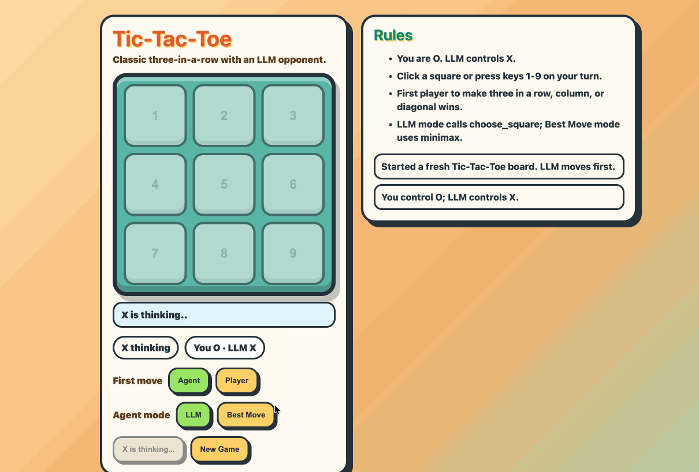
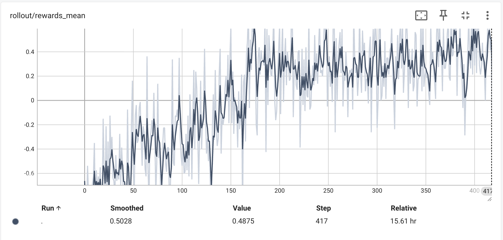
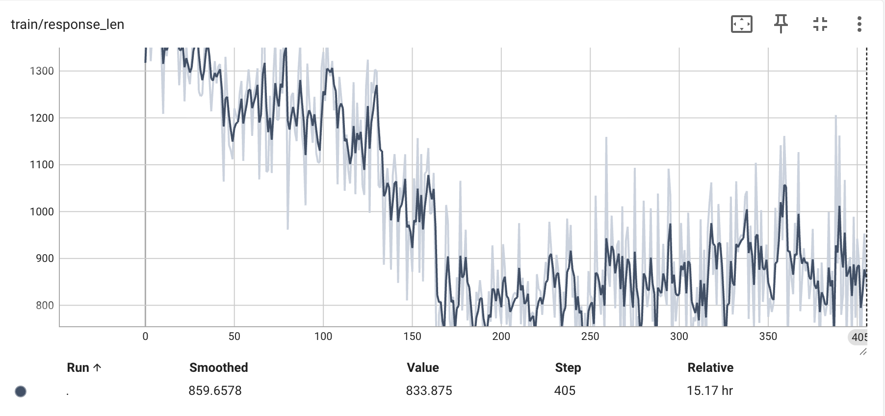
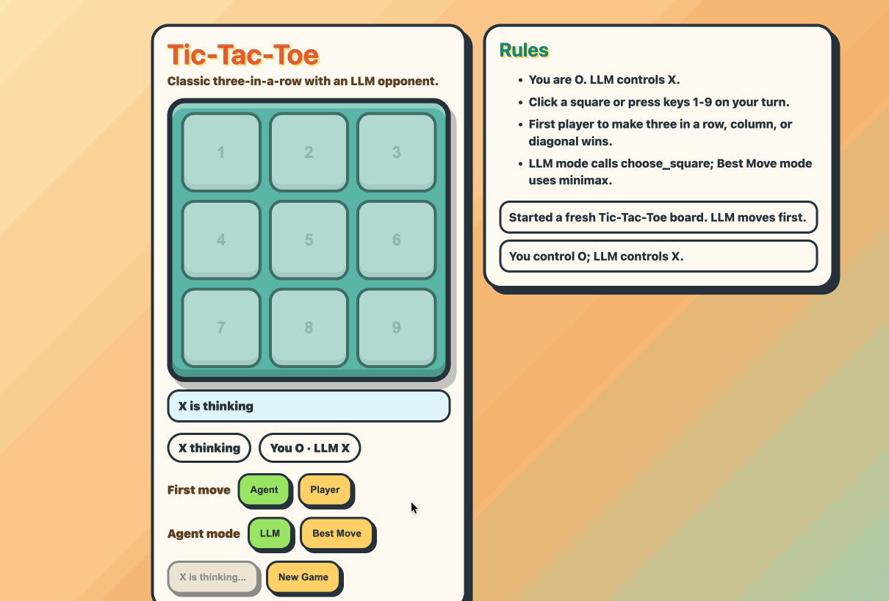

# ASystem AReno：单机玩转 Ling-3.0-tiny 模型后训练

> Ling-3.0-tiny 已经正式开源。
>
> 作为一款总参数量 7.9B、推理时激活参数量仅 1.3B 的轻量模型，它最打动开发者的地方，不只是“小”，而是它真的可以进入更具体的本地设备、真实任务和开发者自己的工作流里。
>
> 那么问题来了：模型已经能在 DGX Spark 上跑起来了，能不能也在 DGX Spark 上训起来？
>
> 这一次，故事的主角就轮到 AReno 登场了。

[文章《Ling-3.0-tiny 正式开源：让 1.3B 激活参数，进入真实任务》](https://mp.weixin.qq.com/s/YyrzNIZpnas4lerpC63DaQ)展示了 Ling-3.0-tiny 在 DGX Spark、MacBook、Mac mini 等本地设备上的运行能力。对开发者来说，这件事的意义很直接：模型不再只能停留在云端 API 或大规模集群里，而是可以进入自己的设备、数据环境和业务流程。

不过，“跑起来”只是第一步。

真正进入具体任务时，开发者还会遇到一个更现实的问题：模型能不能根据我的任务规则、反馈信号和工具环境继续训练？能不能从“会回答”变成“更会做事”？能不能在一次次反馈里变得更稳定、更可控？

这正是 [AReno](https://github.com/inclusionAI/AReno) 想回答的问题。

这次，我们用开源的 AReno，在 DGX Spark 上对 Ling-3.0-tiny 做了一次 Agentic RL 后训练实验：让模型在井字棋环境中完成工具调用、接收规则反馈，并通过 GSPO 训练逐步减少非法动作、提升决策稳定性。

井字棋听起来像个小游戏，但在这个实验里，它承担的是一个很重要的角色：**最小可验证任务**。

它足够小，方便开发者快速理解；它又足够完整，能够覆盖状态理解、工具调用、环境反馈、reward 设计和复测验证。换句话说，我们不是为了让 Tiny “学会下棋”，而是想借这个任务看看：当 Tiny 已经可以在本地设备上高效运行后，AReno 能不能进一步把后训练闭环跑通。

## 从本地推理到本地后训练：Spark 让闭环更完整

随着 Ling-3.0-tiny 在 DGX Spark、MacBook、Mac mini 等本地设备上跑起来，轻量模型已经开始进入更低成本、更贴近开发者日常环境的真实任务中。

这次 AReno 的 Spark 实验，则进一步把问题推进了一步：如果模型已经能在本地跑起来，能不能也在本地完成一次可观察、可复现、可迭代的后训练？

我们的实验结果说明，DGX Spark 不只是一个轻量模型推理设备，也可以成为开发者验证后训练想法的起点。开发者可以在同一类轻量环境中完成任务定义、数据生成、reward 设计、rollout 采样、策略更新和效果复测。

这让 Tiny 的价值从“部署门槛更低”进一步延伸到“任务适配门槛更低”。

## 为什么 Ling-3.0-tiny 适合做任务后训练？

在后训练场景里，模型大小会直接影响开发者能否快速完成一次任务适配闭环。

如果模型太大，一次实验往往需要更高显存、更复杂的并行策略和更长训练等待时间。开发者很难快速回答几个关键问题：我改了 reward，模型行为有没有变化？我换了任务环境，模型是否学会了新的约束？我调整了工具调用逻辑，错误率是否下降？

Ling-3.0-tiny 的优势，正好补上了这个缺口：

- **成本更低**：更适合在 DGX Spark 这类轻量环境中完成训练、调试和复现实验。
- **迭代更快**：reward、数据、prompt、agent 逻辑的调整能更快看到结果。
- **反馈更直接**：开发者可以把模型行为变化和 reward 曲线、response_len、复测表现对应起来看。
- **更适合 Agentic RL 探索**：可以通过工具调用、环境交互、规则反馈等方式，观察模型在多轮决策中的行为变化。

所以，与其只展示 Tiny “能跑起来”，我们更想进一步展示它“能训起来”：在一个规则清晰、反馈明确、可复测的任务环境里，通过 AReno 完成从行为观察到策略更新的闭环。

## 从一个最小可验证任务开始：井字棋 Agentic RL

我们选择井字棋作为第一个验证任务，不是因为它复杂，而是因为它足够清晰。

井字棋只有 9 个格子，规则清晰，胜负容易判断，非常适合做后训练闭环验证。但它又不是纯粹的单步分类任务：模型需要理解当前棋盘状态，选择合法位置，避免重复落子，并在有机会时完成获胜动作。

这让它非常适合作为 Agentic RL 的最小验证环境：

- 模型需要通过 `choose_square` 工具调用来执行动作。
- 环境会判断这一步是否合法、是否最优、是否直接获胜。
- reward 会把“非法动作”“普通合法动作”“最优动作”“获胜动作”区分开。
- 训练后可以回到同一个环境中复测，观察模型行为有没有改善。

换句话说，这不是一个只能看指标的实验。开发者可以直接回到交互环境里，看模型如何调用工具、如何选择动作、在哪里犯错，以及经过训练后是否真的变得更稳定。

更重要的是，这个实验不是一次孤立 demo，而是一条可以复用的轻量模型任务适配路径：

- **基线评测**：先让 Ling-3.0-tiny 在同一个环境中直接对局，观察它是否能理解状态、正确调用工具、选择合法动作。
- **定义反馈**：把规则、非法动作、最优动作和获胜动作转化成清晰 reward。
- **后训练适配**：用 AReno 把 rollout、reward、训练和采样组织成闭环，让模型在交互反馈中更新策略。
- **复测验证**：回到同一个环境中再次对局，用可视化表现、reward 曲线和 response_len 一起判断模型是否真的变好了。

也就是说，这个 case 展示的不只是“Tiny 会下井字棋”，而是一个更通用的方法：先测出模型在具体任务里的行为边界，再用 AReno 完成任务后训练，最后回到同一套环境中复测改进效果。

## 训练前：模型已经能理解规则，但行动还不稳定

在训练前，Ling-3.0-tiny 已经能理解一部分任务上下文，但进入交互环境后，它的行动还不够稳定。

比如在初始表现中，模型会出现判断错误，甚至把棋落到已经被占用的位置上。这类问题在 Agentic RL 里很典型：模型看起来“知道规则”，但一旦进入真实交互环境，工具调用参数、状态理解和动作选择都会暴露问题。



这也是可交互任务的价值所在。

如果只是离线问答，我们很难直观看到模型到底错在“不会规则”“没读懂状态”“工具调用不合法”，还是“知道合法动作但策略不好”。而交互环境会把这些问题拆得很清楚：每一步是否合法、是否违反状态约束、是否错过了更优选择，都能被环境直接评估。

对更真实的业务任务来说，道理也是一样的。一个客服 Agent 是否调用了正确工具，一个流程 Agent 是否填对了表单，一个代码 Agent 是否按要求修改了文件，都需要环境反馈来判断。井字棋只是把这件事压缩到了一个足够小、足够清楚的任务里。

## 数据集怎么设计：让模型面对可复现的任务状态

为了让训练过程可复现，我们先生成一批井字棋中间局面，让模型在不同棋盘状态下学习如何选择下一步动作。

1. 创建空的 3x3 棋盘，空格用 `.` 表示。
2. 从 X 开始，随机走 0 到 6 步。
3. 每一步只能从当前合法空位中随机选择。
4. 一旦出现胜负或棋盘结束，就停止继续落子。
5. 最终只保留三类局面：轮到 X 行动、尚未结束、不重复。
6. 使用固定随机种子，因此相同参数可以重复生成相同数据。
7. 如果随机过程结束时轮到 O，生成器会额外随机落一个 O，使最终轮到 X。

一条数据示例如下，模型需要基于当前棋盘状态选择下一步动作：

```json
{"id":"generated-00000","board":[["X",".","O"],[".",".","."],["X","O","."]]}
```

## Reward 怎么设计：把任务规则转成训练反馈

为了让训练信号尽量直接，我们给井字棋任务设计了一套简单 reward。它的目标不是追求复杂，而是把任务里最关键的行为约束明确表达出来：

- 没有合法的 `choose_square` tool call：`-1.0`
- 参数无法解析或选择已占用格子：`-1.0`
- 当前一步让 X 立即获胜：`1.0`
- 没有立即获胜，但属于最优动作：`0.8`
- 合法但非最优动作：`0.0`

这个 reward 抓住了任务训练最重要的三件事。

首先，模型必须学会用正确的工具格式行动。其次，模型必须遵守环境状态，不能选择已占用格子。最后，模型要在合法的基础上进一步追求更优策略。

这也是 AReno 希望提供的后训练体验：开发者不需要先搭建一个庞大的系统，而是可以从一个明确任务开始，定义环境、定义 reward、跑通 rollout 和训练，然后观察模型行为变化。

## Spark 实测：模型不只跑起来，也能在反馈中变稳定

本次实验在 DGX Spark 环境上完成，使用 AReno 的 GSPO 算法训练 400 个 step。

训练过程中，`rollout/rewards_mean` 从平均约 `-0.5` 上升到 `0.4` 左右，说明模型在逐步减少非法动作，提高有效行动比例，并学会选择更合理的落子策略。



同时，`response_len` 下降到约 `850 tokens`。这意味着模型在完成任务时变得更简洁，减少了不必要的冗长思考和无效输出。对 Agentic 任务来说，这一点同样重要：模型不只是要做对，还要以更稳定、更高效的方式完成任务。



一个指标反映任务反馈变好，另一个指标反映模型输出变得更收敛。两者结合起来看，能更完整地说明后训练正在改变模型的行为方式。

指标之外，更直观的是回到同一个交互环境中复测模型表现。

可以看到，训练后的 Ling-3.0-tiny 在工具调用和动作选择上稳定了很多，能更好地遵守棋盘状态，也能在关键位置做出更合理的选择。



对 AReno 来说，这个结果的意义不只是 reward 上升。

更重要的是，它说明在 DGX Spark 这样的轻量环境中，开发者可以完成一次相对完整的后训练闭环：定义任务、生成数据、设计 reward、采样 rollout、更新策略，再回到同一环境中复测模型行为。

这让 Tiny 的价值从“能在本地设备上运行”，进一步延伸到“能在本地任务中继续适配”。对于开发者来说，这意味着他们可以从一个小任务开始，验证自己的 reward 和 agent 逻辑是否有效，再逐步迁移到更真实的业务流程中。

## 如何在 DGX Spark 上复现实验？

我们已经提供了在 DGX Spark 上通过 Docker 运行训练的完整教程。开发者可以直接按照指南复现井字棋实验，也可以在跑通后替换数据集、reward 或 agent function，把它改造成自己的任务后训练实验。

教程见：[tiny v3 on spark](https://github.com/inclusionAI/AReno/blob/main/examples/agentic/tictactoe/DGX_SPARK_GUIDE_CN.md)

## 回到 AReno：把轻量模型任务适配做成闭环

[AReno](https://github.com/inclusionAI/AReno)，全称 **ASystem Reinforcement Learning Nano**，是由蚂蚁 ASystem 团队发起、InclusionAI 开源体系下维护的本地化大模型后训练工具包。

如果说 Ling-3.0-tiny 解决的是轻量模型如何进入本地设备和真实任务环境，那么 AReno 解决的是：模型进入任务之后，如何继续根据反馈变得更适合这个任务。

我们做 AReno 的初衷，是希望降低大模型后训练和任务适配的工程门槛。

过去，强化学习后训练往往意味着训练框架、推理服务、算子依赖、环境配置、集群资源、reward 设计、Agent 轨迹采集等一整套复杂系统。任何一个环节没有打通，一个原本很具体的任务适配想法，都可能停在“还没跑起来”。

AReno 希望反过来做一件事：让更多开发者可以从一台机器、一个小模型、一个明确任务开始，把后训练完整流程真正跑起来，并且看见模型在反馈中如何变好。

在这个闭环里，AReno 负责把几个关键环节连接起来。目前 AReno 支持：

- SFT / DPO 风格训练
- RL 后训练
- Agentic RL
- 本地模型服务
- Reward Function 自定义
- 训练、推理、采样与优化闭环

对开发者来说，AReno 的优势可以概括为五点：

- **训得起**：面向小模型和本地环境，降低后训练实验的资源门槛。
- **跑得通**：把 rollout、reward、train、serve 组织成一个完整闭环。
- **看得见**：通过 reward 曲线、response_len 和复测 Demo 观察模型行为变化。
- **改得动**：开发者可以替换数据、环境、reward 和 agent function。
- **迁移得走**：井字棋只是示例，同一套方法可以迁移到工具调用、结构化抽取、流程 Agent 等任务。

井字棋只是一个开始。

接下来，AReno 还会持续补充更多面向小模型、Agentic RL、开发者实践和高校教学的案例。我们希望开发者可以从更小、更直观的任务出发，逐步把后训练方法迁移到自己的真实场景中。

## 欢迎一起参与

我们相信，真正有生命力的开源项目，不只是发布代码，而是让更多人能用起来、改起来、贡献回来。

如果你对以下方向感兴趣，欢迎加入我们：

- 轻量模型后训练
- Agentic RL
- Reward Function 设计
- 工具调用与流程 Agent
- 小模型任务适配
- 本地化 AI 工具链
- AI 教学与开发者社区

Ling-3.0-tiny 让轻量模型具备进入本地设备和真实任务的能力基础，AReno 则希望进一步降低后训练和任务适配的门槛。

从 DGX Spark 上的井字棋实验开始，我们看到的不只是一个游戏 Demo，而是一条更通用的路径：先让模型在本地跑起来，再通过 AReno 定义任务、设计反馈、完成训练，最后回到同一个环境中验证模型是否真的变好。

这条路径可以继续迁移到工具调用修复、结构化抽取、领域指令遵循、个人写作格式适配、业务流程 Agent 等更多场景。

从跑起来，到训起来，再到适配自己的任务。

这就是 Ling-3.0-tiny x AReno 想带给开发者的下一步。

欢迎访问 [AReno GitHub 仓库](https://github.com/inclusionAI/AReno)，复现这个 Spark 后训练实验，也欢迎提交 Issue、参与讨论，或者贡献你的 Tiny 个性化训练 case。

> 蚂蚁 ASystem 致力于打造下一代 AI 基础软件，并基于下一代 AI 基础软件寻找通用智能的新方法，追求智能上限。目前已开源 Awex、AMem、AState、AReno 等多个项目。
>
> 欢迎你的加入：pub_asystem@antgroup.com
