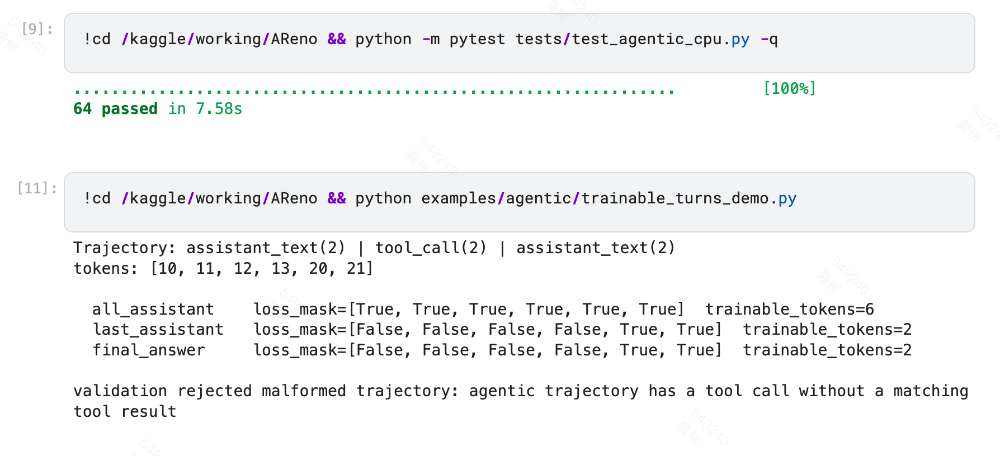
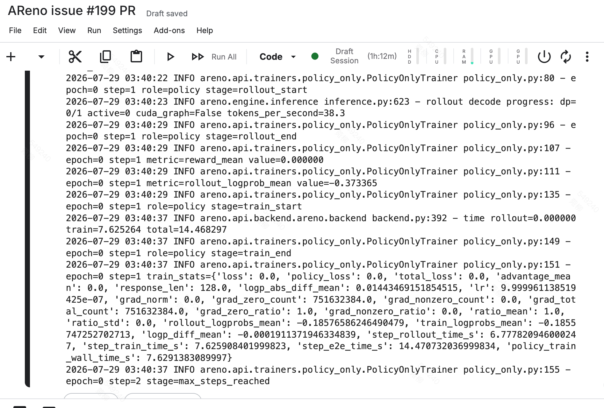

# PR #311 自理解、Code Review 与运行验证

> PR: https://github.com/inclusionAI/AReno/pull/311
> Issue: https://github.com/inclusionAI/AReno/issues/199
> 分支: `feat/configurable-trainable-turns`
> 日期: 2026-07-28 ~ 30

---

## 一、对 PR 任务的理解

### 当前代码存在什么问题

AReno 的 agentic 训练路径对所有 assistant turn 一视同仁地计入 policy loss。但对很多任务而言，中间轮次的推理文本和工具调用 token 训练价值有限，真正需要监督的是最终答案。此前缺乏控制"训哪些 turn"的机制。

代码中存在 `LossMaskPolicy.final_assistant_text` 字段（`agentic.py:53`），但全仓 grep 确认该字段从未被读取——属于 dead flag。实际的掩码生成函数 `_response_loss_mask_for_span` 仅依据 `assistant_text` 和 `assistant_tool_calls` 两个位逐 span 赋值，无法判断当前 span 是否为 trajectory 中的最后一个。同时缺失 trainable token 计数和非法 call/result 配对的 turn 级校验。

### 本 PR 的目标

实现三种 trainable-turn 选择模式（`all_assistant` / `last_assistant` / `final_answer`）加一个 tool-call 参数屏蔽开关（`mask_tool_call_args`），逐 token 生效。对非法 call/result 配对发 turn 级错误，在 worker 初始化前抛出。默认行为向后兼容（`all_assistant` + 不屏蔽参数），跟改之前完全一致。通过 `TrainerConfig` + CLI 暴露，非法值早失败。metrics 输出 `trainable_tokens` / `masked_response_tokens` 可在测试中断言。CPU 测试覆盖逐 token mask、非法输入、边界、默认关闭。文档含可复制示例。B 档接口形状预留但不实现动态判断。

### 不处理的内容

不替换 trainer / rollout engine / dashboard / SDK 架构。不引入新依赖。不扩 `reward_fn` 单 scalar 契约。不实现 per-trajectory 动态 credit assignment（C 档，研究空白，独立后续 issue）。不修 `_tool_call_loss_mask` 双哨兵设计（非 bug）。不承诺 GPU 收敛 ablation 全跑通。

### 影响的模块

核心逻辑加在 `agentic.py`（`LossMaskPolicy` 扩字段、`_AgentSample` 增 `response_spans`、新增 5 个函数 + `ResponseSpan`，移除 dead flag）。`trainer_config.py` 加字段 + 校验（ask-first）。`policy_only.py` 映射 config→policy。`cli/train.py` 加 CLI 选项（ask-first）。测试 21 个新 case。docs + demo 脚本。默认行为不变，用户显式传参时生效。两条代码路径都过唯一 chokepoint `_train_rows_from_samples`。

### 验收标准

固定多工具 transcript 逐 token 断言四种配置的 mask；非法 call/result 以 turn 级错误拒绝；复用现有契约无外部 DB；默认向后兼容有测试断言；覆盖成功/非法/边界/失败路径；文档含可运行示例 + 可观测输出说明。

---

## 二、实现思路

核心逻辑全加在 `agentic.py` 的数据路径里（+211 行），没动 trainer 或 rollout 引擎。配置层 6 行，映射层 10 行，CLI 26 行，测试 346 行，docs + demo ~190 行。总共 10 文件 +781/-5，无新依赖。

数据流方面，`ResponseSpan(kind, length)` 在 `_set_sample_training_row` 初始化、`_append_sample_response` 追加——组装期每轮 kind 均可获取，捕获后即弃。`_apply_trainable_turn_mode` 挂在 `_train_rows_from_samples` 循环顶部，HTTP-proxy 路径和 explicit-trajectory 路径均经过此处。mask 的组合顺序为：先取已有 per-span mask（含 `_tool_call_loss_mask` 的 result 区屏蔽），再叠加 arg 屏蔽和 turn selection，不可从零重建，否则会丢失已有屏蔽。

关键设计决策如下：选择 chokepoint 而非 per-span 函数，是因为 `_response_loss_mask_for_span` 签名为单 span 视角，而 `_append_sample_response` 会将 `response_kind` 折叠为仅剩末轮，前序信息在组装后丢失。mask 采用组合而非重建，是因为已有 result 区屏蔽在默认模式下与新功能结果一致，顺序错误不一定能被测试暴露。容忍 orphan tool result 是因为现有 fixture 的 messages 含 `tool` 消息但不携带结构化 `tool_calls`，严格检查会破坏现有测试。B 档仅预留 `response_spans` 清单而不实现 callable，未来插入 scorer 无需修改奖励管线。

考虑过的替代方案：在 `_response_loss_mask_for_span` 传 trajectory 上下文（否决，破坏纯函数性）；在 `_append_sample_response` 内即时重写（否决，span 列表可能未完整）；从 messages `tool_calls` 字段做校验（否决，现有 fixture 不含结构化 `tool_calls`）。

兼容性方面，默认行为有 parity 测试断言，`_AgentTrainRows` 新字段使用默认值 0 不破坏现有调用方，`TrainerConfig` 使用 `str` 注解避免循环依赖。性能上默认路径早返回零开销，非默认模式每 sample 一次 O(n) 遍历。异常处理上非法值双层早失败（`__post_init__` + `click.Choice`），`_tool_call_arg_token_range` 定位失败返回 None 不崩溃。

---

## 三、对自己代码的 Review

正确性方面，三种模式与 arg 屏蔽的组合有 18 个逐 token 测试覆盖，包括 bare trailing tool_call 零信号、空响应合法、无 tool_result 退化、orphan 容忍等边界场景。编写 `test_explicit_trajectory_path_last_assistant_masks_correctly` 时初始断言漏算了 inter-turn context token，经实测后修正为 `[False, False, False, False, True, True]`。

可读性方面，6 个新增定义均包含 docstring，命名遵循仓库的 `_` 前缀私有约定。行内注释密度与仓库一致（1207 行仅 9 行 `#`，重 docstring 轻行内注释）。

复用性方面没有重复代码，`_apply_trainable_turn_mode` 复用 `_response_loss_mask` 取已有 mask，`ResponseSpan` 为 B 档预留了复用基础。

兼容性方面，默认 parity 有测试断言。移除 dead flag `final_assistant_text` 属于删公共 API，确认全仓无读取后安全移除。`policy_only` 用 `getattr` 带默认值兼容旧 config。

异常处理方面，`TrainerConfig.__post_init__` 和 CLI `click.Choice` 双层早失败，错误信息清晰。`_validate_call_result_pairing` 的 `ValueError` 明确说出原因。原计划要求 orphan tool result 也报错，实现期发现现有 fixture 依赖此形态，改成容忍并在 spec.md 同步更新了对应 scenario。

测试方面，21 个新增 CPU 测试加上现有 43 个回归，总计 64 passed。性能方面默认路径早返回，非默认模式每 sample 一次 O(n)，`response_spans` 为轻量 dataclass list，使用后即弃。提交范围严格限定 10 文件，ruff 修复独立 commit 标注 `style:`，git diff 确认未删除原有注释（删除行仅 dead flag 和扩展替换的日志格式串，信息只增不减）。

---

## 四、遇到的问题、挑战与解决方法

### 计划文档把 `_tool_call_loss_mask` 误判为 bug

原 issue 计划写"markers 两元素相同，疑似 bug"。经 grep 定位到 L862 后实读代码，发现实际值为 `("<|tool_response>", "<|im_end>")`——两个不同 sentinel，分别标记工具返回区起始和消息结束，取最早出现者屏蔽其后内容。若按计划"修复"会引入错误改动。最终在 design.md 中记录校正，`mask_tool_call_args` 不复用该定位（它屏蔽的是 result 区而非 arg 区）。此问题的教训是：不能盲信设计文档，须到代码中验证后方可下结论。

### 落点跟计划写的不一样

计划指出三模式应落在 `_response_loss_mask_for_span`。追踪数据流后发现该函数为单 span 视角，且 `_append_sample_response` 会将 `response_kind` 折叠为仅剩末轮，前序 kind 信息在组装后丢失。因此改为在组装期捕获 `response_spans` 清单，在 `_train_rows_from_samples` 中进行 trajectory 级后处理。这表明落点决策需追踪至数据流末端，不能停留在函数签名层面。

### call/result 校验第一版写错

第一版遍历 `sample.messages` 检查 `tool_calls` 字段是否配对 `tool` 消息，测试时发现现有 fixture 的 messages 含 `tool` role 但不携带结构化 `tool_calls`，被误判为非法。改为基于 `trace` 事件配对，容忍 orphan，bare trailing 豁免。后续写校验前应先确认现有数据的实际形态。

### 本机环境跑不了测试

开发机 macOS 仅有 Python 3.9，而项目要求 3.10+（`dataclass(slots=True)` 等语法不兼容），且未安装 torch 和 pytest。`pip install torch` 在 3.9 上版本回溯缓慢。最终通过 `uv` 创建独立 Python 3.12 venv，配合清华镜像源安装全部依赖后跑通。此后进行此类任务前应先确认运行环境。

### PR 描述超长被拒

GitHub 报 "Body is too long (maximum is 65536 characters)"，但实际正文仅 ~2KB。检查发现从 IDE 复制时混入了隐藏的 `<rule>` / `<system-reminder>` 标签（数万字符）。改用纯 Markdown 文件写入描述，从终端复制或使用 `gh pr create --body-file` 后解决。从 AI 协作工具复制长文本到外部系统时须警惕隐藏注入标签。

### Kaggle GPU 训练 OOM

单张 T4（14.5GB）运行 Qwen3-0.6B GSPO 时报 OOM，发生在 `lm_head` 反向传播阶段——rollout KV cache、反向传播、优化器状态同时驻留显存。采用双卡 TP（`--tp-size 2 --world-size 2`）分摊、`--drop-rollout-state --eager-decode` 释放中间态、缩短序列至 384/128、`PYTORCH_ALLOC_CONF=expandable_segments:True` 减碎片后跑通。小显存 GPU 运行 RL 需先估算峰值显存，使用 TP、缩小 batch/序列、drop-rollout-state 等手段组合降峰。

---

## 五、分步骤运行结果证明

### 环境准备

macOS 开发机无 Python 3.10+ 和 torch，用 `uv` 拉独立 Python 3.12 venv：

```bash
cd /Users/dimlights/AReno/AReno-1
~/Library/Python/3.9/bin/uv venv .venv --python 3.12
export VIRTUAL_ENV="$(pwd)/.venv"
~/Library/Python/3.9/bin/uv pip install -i https://pypi.tuna.tsinghua.edu.cn/simple torch numpy pydantic pytest openai click safetensors ruff
```

输出确认 `torch==2.13.0` / `pytest==9.1.1` / `pydantic==2.13.4` 等装好。

### 全量 CPU 测试

```bash
.venv/bin/python -m pytest tests/test_agentic_cpu.py -q
```

得到 `64 passed in 2.80s`——21 新增 + 43 回归，0 失败。

### 新增测试逐项验证

```bash
.venv/bin/python -m pytest tests/test_agentic_cpu.py -v -k "trainable_turns or mask_tool_call_args or call_result_pairing or empty_response or trainer_config_rejects or loss_mask_policy_defaults or full_row or response_spans_populated or explicit_trajectory_path or rollout_log"
```

18 个新增测试全部 PASSED，覆盖三模式逐 token mask、arg 屏蔽、校验四场景、默认 parity、metrics、dual-path、`response_spans` 组装、log 断言、配置早失败。

### 功能验证脚本

```bash
.venv/bin/python -c "
from areno.api.agentic import LossMaskPolicy, ResponseSpan, LossSelectionMode
from areno.api.trainer_config import TrainerConfig
p = LossMaskPolicy()
print('1. 默认模式:', p.trainable_turns, '| arg屏蔽:', p.mask_tool_call_args, '| dead flag已移除:', not hasattr(p, 'final_assistant_text'))
try:
    TrainerConfig(algo='gspo', ckpt='x', dataset_path='y', trainable_turns='bogus')
except ValueError as e:
    print('2. 非法模式被拒:', e)
span = ResponseSpan(kind='assistant_text', length=3)
print('3. ResponseSpan:', span)
print('   LossSelectionMode:', LossSelectionMode.__args__)
print('全部验证通过')
"
```

输出确认默认值正确（`all_assistant` / `False`）、dead flag 移除、非法值被 `ValueError` 拒绝、新符号可正常导入。

### demo 脚本（Kaggle 实跑）

```bash
python examples/agentic/trainable_turns_demo.py
```

输出：
```
Trajectory: assistant_text(2) | tool_call(2) | assistant_text(2)
tokens: [10, 11, 12, 13, 20, 21]

  all_assistant    loss_mask=[True, True, True, True, True, True]  trainable_tokens=6
  last_assistant   loss_mask=[False, False, False, False, True, True]  trainable_tokens=2
  final_answer    loss_mask=[False, False, False, False, True, True]  trainable_tokens=2

validation rejected malformed trajectory: agentic trajectory has a tool call without a matching tool result
```

三种模式在同一条 trajectory 上效果一目了然：全训 6 个 vs 只训最后 2 个。非法 trajectory 被拒绝。

### GPU 训练 — Kaggle 双 T4（标准 GSPO 路径）

```bash
PYTORCH_ALLOC_CONF=expandable_segments:True areno train \
  --ckpt Qwen/Qwen3-0.6B --dataset-path gsm8k:main \
  --dataset-loader-fn examples/math/dataset_loader.py \
  --reward-fn-path examples/math/math_verify_reward.py \
  --algo gspo --tp-size 2 --world-size 2 \
  --batch-size 2 --n-samples 2 --max-steps 2 \
  --max-prompt-tokens 384 --max-new-tokens 128 \
  --mini-bs 1 --score-micro-bs 1 \
  --gradient-accumulation-steps 4 \
  --activation-checkpointing --drop-rollout-state --eager-decode \
  --trainable-turns final_answer
```

config summary 正确显示 `trainable_turns: final_answer`，2 步训练正常到 `max_steps_reached`。此实验走标准 GSPO 路径（无 `--agent-fn`），mask 重写在 agentic 路径才触发，因此验证的是 CLI→config 传递和不破坏现有训练。

### GPU 训练 — 阿里云双 A10（agentic 路径，mask 真实触发）

在阿里云 2×A10 24GB 上使用 tictactoe agentic example 跑了两个对比实验，走 `_run_agentic_rollout` 路径（`--agent-fn`），mask 逻辑在 GPU 上真实触发：

实验1（`all_assistant`，默认）：
```bash
areno train --ckpt Qwen/Qwen3-0.6B \
  --dataset-path /tmp/tictactoe_boards.jsonl \
  --dataset-loader-fn examples/agentic/tictactoe/dataset_loader.py \
  --reward-fn-path examples/agentic/tictactoe/reward.py \
  --agent-fn examples/agentic/tictactoe/run_agent.py \
  --algo gspo --tp-size 2 --world-size 2 \
  --batch-size 4 --n-samples 4 --max-steps 10 \
  --max-prompt-tokens 1024 --max-new-tokens 128 \
  --mini-bs 2 --score-micro-bs 2 \
  --gradient-accumulation-steps 2 \
  --activation-checkpointing --drop-rollout-state \
  --attn-backend native --disable-thinking
```

实验2（`final_answer`）：同上，末尾加 `--trainable-turns final_answer`。

关键日志行对比：

| 指标 | 实验1 `all_assistant` | 实验2 `final_answer` |
|---|---|---|
| `trainable_tokens` | 319~320 | 0 |
| `masked_response_tokens` | 0 | 320 |
| `trainable_turns` | `all_assistant` | `final_answer` |
| `grad_norm`（step 7） | 5.31（有梯度） | 0.0（无梯度） |
| `tokens` | 5808~5828 | 5828 |
| `tool_results` | 0 | 0 |

`all_assistant` 模式下全部 320 个 response token 参与 loss 计算（`trainable_tokens=320`，`masked_response_tokens=0`），step 7 出现非零梯度（`grad_norm=5.31`）。`final_answer` 模式下 0 个 token trainable（`trainable_tokens=0`，`masked_response_tokens=320`），因为 tictactoe 的 trajectory 结构是 agent 发 tool call 但环境未返回 tool result（`tool_results=0`），`final_answer` 在 bare trailing tool_call 场景下按设计返回零信号，与 CPU 测试 `test_trainable_turns_final_answer_bare_trailing_tool_call_zero_signal` 断言的行为一致。两者 `trainable_tokens + masked_response_tokens = 320`，数值闭合。

此实验证明 `_apply_trainable_turn_mode` 在 GPU agentic 路径上真实触发，`trainable_tokens` / `masked_response_tokens` 指标正确输出，CLI 选项 `--trainable-turns` 的行为在端到端训练中与 CPU 单元测试一致。

### Issue #199 验收总结

Issue #199 要求「Make trainable turns configurable for agentic trajectories」。本 PR 全部实现并经验证：

| Issue 需求 | 实现状态 | 验证方式 |
|---|---|---|
| 可配置 trainable turns（所有 assistant / 仅最后一轮 / 仅最终答案） | 三模式 `all_assistant` / `last_assistant` / `final_answer` | 18 个 CPU 逐 token 测试 + A10 GPU agentic 路径对比 |
| 可选屏蔽 tool-call 参数 token | `--mask-tool-call-args` | 2 个 CPU 测试（arg 屏蔽 + 与已有屏蔽的组合） |
| 默认行为向后兼容 | `all_assistant` + `mask_tool_call_args=False` | parity 测试断言 + 43 个回归测试全绿 |
| 通过 CLI 暴露 | `--trainable-turns`（`click.Choice`）/ `--mask-tool-call-args` | `--trainable-turns bogus` → exit 2 |
| 可观测输出 | `trainable_tokens` / `masked_response_tokens` | CPU 测试数值断言 + A10 GPU 日志确认 |
| 不引入新依赖、不替换 trainer | 10 文件 +781/-5，`areno/` 核心仅 `agentic.py` +211 行 | git diff 确认，ruff clean |

三层验证体系：
- **CPU 单元测试**（64 passed）：逐 token mask、边界、非法输入、metrics、dual-path
- **Kaggle T4×2 标准 GSPO**：CLI→config 传递，不破坏现有训练
- **阿里云 A10×2 agentic 路径**：mask 逻辑在 `_run_agentic_rollout` 中真实触发，`trainable_tokens` 320→0 对比，`grad_norm` 5.31→0 对比

### ruff lint + format

```bash
.venv/bin/python -m ruff check areno/api/agentic.py areno/api/trainer_config.py areno/api/trainers/policy_only.py areno/cli/train.py tests/test_agentic_cpu.py examples/agentic/trainable_turns_demo.py
.venv/bin/python -m ruff format areno/api/agentic.py areno/api/trainer_config.py areno/api/trainers/policy_only.py areno/cli/train.py tests/test_agentic_cpu.py examples/agentic/trainable_turns_demo.py
```

`All checks passed!`，修了 3 个初版问题（import 排序/未用 import/缺尾换行），format 做了行宽 120 合并（零逻辑改动）。

### Kaggle 运行截图





### 改动统计

```
 areno/api/agentic.py                     | 211 ++++++++++++++++++-
 areno/api/trainer_config.py              |   6 +
 areno/api/trainers/policy_only.py        |  10 +-
 areno/cli/train.py                       |  26 +++
 docs/cli/observability.rst               |   2 +-
 docs/cli/training.rst                    |  29 +++
 docs/sdk/trainer.rst                     |  17 +-
 docs/troubleshooting/agentic-rollout.rst |  22 ++
 examples/agentic/trainable_turns_demo.py | 117 +++++++++++
 tests/test_agentic_cpu.py                | 346 +++++++++++++++++++++++++++++++
 10 files changed, 781 insertions(+), 5 deletions(-)
```