Kaggle dataset-mixing validation
================================

This guide records the reproducible Kaggle GPU validation for deterministic
weighted SFT dataset mixing introduced by Issue #198. It covers environment
setup, model preparation, a three-source training run, deterministic-plan
verification, filtering analysis, and the evidence that should be captured
from the Kaggle notebook.

The validation targets the data-mixing and SFT execution contracts. It is not
an evaluation of downstream model quality. Prompts, responses, credentials,
and Hugging Face tokens must not be included in screenshots or attached logs.

Validation summary
------------------

The tested implementation completed all of the following:

* loaded and normalized three public Alpaca-contract datasets;
* produced the requested 60/30/10 deterministic sample schedule;
* reproduced the same schedule hash across three independent runs;
* completed 500 SFT optimizer steps with two-GPU tensor parallelism;
* trained 1,000 accepted rows and 77,533 target tokens;
* exposed source-specific scheduled, filtered, trained, and token counts;
* completed without NaN, Inf, CUDA, or worker errors.

The implementation under test was commit ``e33e40d``. Later commits on the PR
branch only add or refine documentation.

Validated environment
---------------------

The run was captured from a fresh Kaggle notebook with Internet access and the
GPU accelerator enabled.

.. list-table::
   :header-rows: 1
   :widths: 32 68

   * - Component
     - Observed value
   * - Operating system
     - Linux 6.12, x86_64
   * - Python
     - 3.12.13
   * - PyTorch
     - 2.10.0+cu128
   * - PyTorch CUDA build
     - 12.8
   * - NVCC
     - 12.8 (V12.8.93)
   * - Accelerator
     - 2 x Tesla T4; the SFT runs used both GPUs with tensor parallelism
   * - Per-GPU memory
     - 15,360 MiB reported by ``nvidia-smi``
   * - GPU compute capability
     - 7.5
   * - Attention backend
     - ``native``
   * - Model
     - Qwen3-0.6B converted to FP16

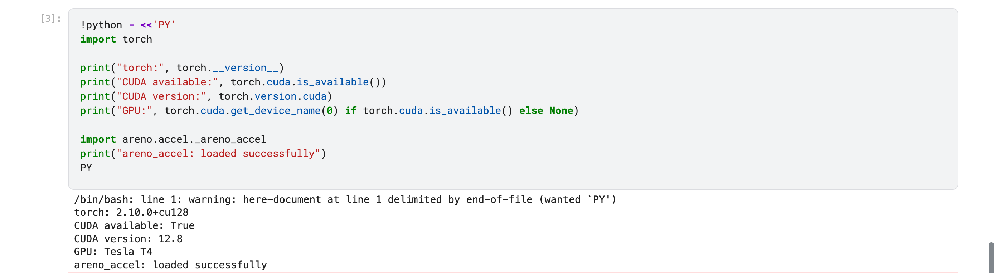

   Kaggle environment check showing PyTorch 2.10.0+cu128, CUDA 12.8, a
   visible Tesla T4, and a successful import of the compiled
   ``areno_accel`` extension.

1. Check out the PR branch
--------------------------

Clone the fork branch into the ephemeral Kaggle working directory:

.. code-block:: bash

   cd /kaggle/working
   git clone \
     --branch codex/issue-198-dataset-mixing \
     --single-branch \
     https://github.com/lkxdsb/AReno.git
   cd /kaggle/working/AReno

Record the exact source revision before installing:

.. code-block:: bash

   git branch --show-current
   git rev-parse HEAD
   git status --short --branch

The branch should be ``codex/issue-198-dataset-mixing`` and the working tree
should be clean. The exact commit can be newer than the validated
implementation commit when it contains documentation-only updates.

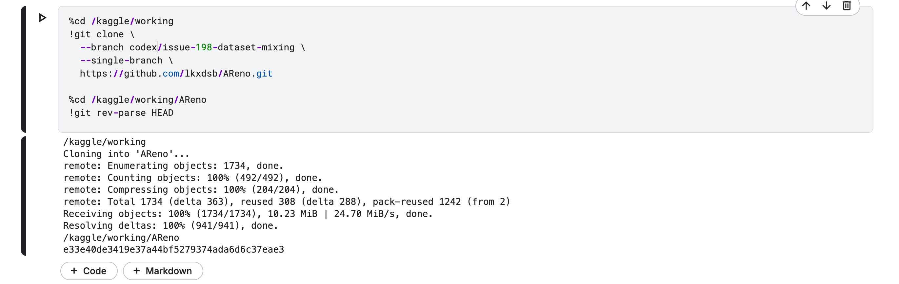

   The notebook cloned ``codex/issue-198-dataset-mixing`` and recorded
   implementation revision
   ``e33e40de3419e37a44bf5279374ada6d6c37eae3`` before installation.

2. Install AReno and compile the CUDA extension
-----------------------------------------------

Kaggle's T4 uses compute capability 7.5. Restricting the extension build to
``sm_75`` reduces build time and temporary disk use:

.. code-block:: bash

   export CUDA_HOME=/usr/local/cuda
   export TORCH_CUDA_ARCH_LIST=7.5
   export MAX_JOBS=2

   python -m pip install "setuptools>=69" wheel psutil ninja
   python -m pip install "flash-linear-attention>=0.2"
   python -m pip install -e . --no-build-isolation

Do not set ``ARENO_BUILD_EXT=0`` for this validation. Native attention still
uses the compiled ``areno_accel`` extension for training operations.

Run the built-in diagnostic after installation:

.. code-block:: bash

   areno check

The check must see CUDA, the model/runtime dependencies, and the compiled
extension. A successful package installation without ``areno_accel`` is not a
valid training environment. A missing ``flash_attn`` warning is acceptable for
this test because the command explicitly selects ``--attn-backend native``;
the diagnostic must still exit with code zero.

The environment figure above is the retained installation evidence: it proves
that CUDA is available and the compiled extension imports successfully. For a
new reproduction, retain the complete ``areno check`` output as well. The
shell here-document warning visible in the captured cell came from the
notebook wrapper and did not affect the successful CUDA or extension imports.

3. Prepare the FP16 checkpoint
------------------------------

The T4 run used a local FP16 copy of Qwen3-0.6B:

.. code-block:: python

   import torch
   from transformers import AutoModelForCausalLM, AutoTokenizer

   model_id = "Qwen/Qwen3-0.6B"
   output_dir = "/kaggle/working/qwen3-0.6b-fp16"

   tokenizer = AutoTokenizer.from_pretrained(model_id)
   model = AutoModelForCausalLM.from_pretrained(
       model_id,
       dtype=torch.float16,
       low_cpu_mem_usage=True,
   )
   model.save_pretrained(output_dir, safe_serialization=True)
   tokenizer.save_pretrained(output_dir)

   print("checkpoint:", output_dir)
   print("dtype:", next(model.parameters()).dtype)

Warnings about anonymous Hugging Face rate limits or tied-weight metadata do
not invalidate the conversion. The decisive evidence is a completed
``model.safetensors`` write and ``torch.float16`` parameter dtype.

The captured notebook used the older ``torch_dtype=torch.float16`` spelling.
The reproduction cell above uses ``dtype=torch.float16`` because current
Transformers versions deprecate ``torch_dtype``.

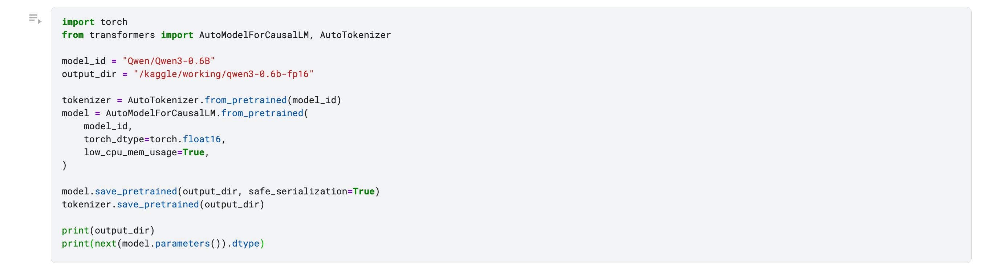

   Model-preparation cell used to download Qwen3-0.6B and write a local FP16
   checkpoint.

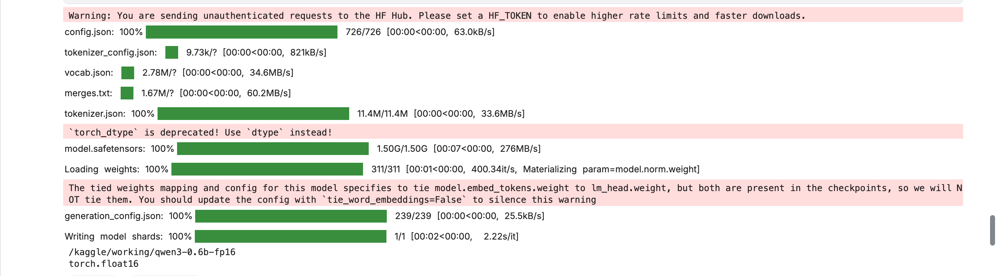

   Completed weight download and checkpoint write. The final output confirms
   ``/kaggle/working/qwen3-0.6b-fp16`` and ``torch.float16``.

4. Define the three-source mix
------------------------------

The GPU validation used three datasets accepted by the shared Alpaca loader:

.. list-table::
   :header-rows: 1
   :widths: 24 48 14 14

   * - Source name
     - Dataset reference
     - Weight
     - Rows available
   * - ``alpaca``
     - ``yahma/alpaca-cleaned``
     - 0.6
     - 51,760
   * - ``stanford``
     - ``tatsu-lab/alpaca``
     - 0.3
     - 52,002
   * - ``gpt4``
     - ``vicgalle/alpaca-gpt4``
     - 0.1
     - 52,002

All three sources are normalized by
``examples/sft/alpaca/dataset_loader.py`` into the SFT ``prompt`` /
``response`` contract. The source names are diagnostic identifiers and do not
need to match repository names.

Inline source weights are normalized automatically. The run used the inline
defaults:

* seed: ``42``;
* exhaustion: ``cycle``;
* shuffle within sources: enabled;
* weight unit: ``sample``;
* samples per epoch: sum of loaded source row counts when omitted.

5. Run the 500-step validation
------------------------------

The notebook first ran 50-step checks at 128 and 256 tokens, then ran the final
500-step validation at 256 tokens. Sections 8 through 10 retain the commands
and final output from all three passes.

The following is the command corresponding to the recorded 500-step result:

.. code-block:: bash

   areno train \
     --algo sft \
     --ckpt /kaggle/working/qwen3-0.6b-fp16 \
     --model-hub hf \
     --dataset-source alpaca=yahma/alpaca-cleaned:0.6 \
     --dataset-source stanford=tatsu-lab/alpaca:0.3 \
     --dataset-source gpt4=vicgalle/alpaca-gpt4:0.1 \
     --dataset-loader-fn examples/sft/alpaca/dataset_loader.py \
     --world-size 2 --tp-size 2 \
     --batch-size 2 --mini-bs 1 \
     --max-steps 500 \
     --max-prompt-tokens 256 --max-new-tokens 256 \
     --attn-backend native

This run intentionally omitted ``--save-path`` because its purpose was feature
validation rather than preserving a fine-tuned model. Add a save path for a
training run whose weights must survive process exit:

.. code-block:: bash

   --save-path /kaggle/working/qwen3-mixed-sft \
   --save-interval 500

The recorded plan used the automatic 155,764-row epoch budget. For a shorter
bounded plan, add:

.. code-block:: bash

   --dataset-mix-samples-per-epoch 5000

This option bounds scheduled rows. It does not limit source download/loading,
and it does not guarantee 5,000 accepted training rows. In this configuration,
``500 steps x batch size 2`` requires 1,000 accepted rows; filtering causes the
trainer to scan more than 1,000 scheduled rows to fill those batches.

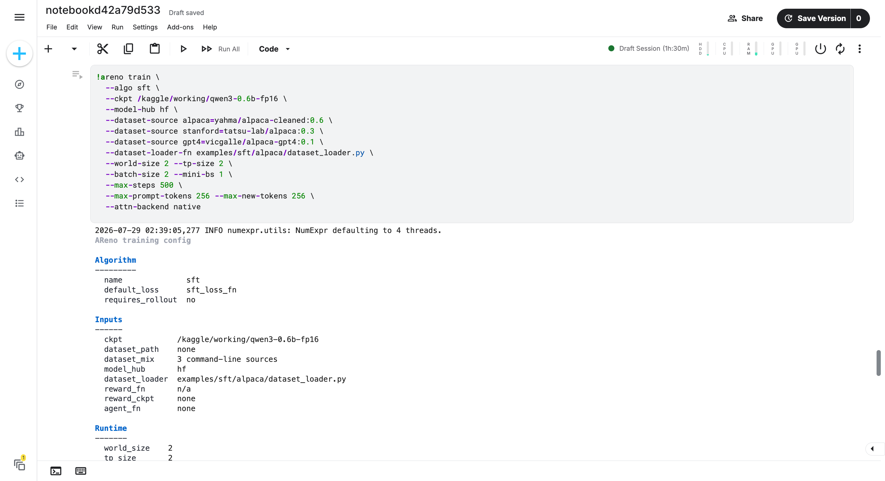

   The 500-step command and the beginning of AReno's resolved configuration.
   It records three inline sources, ``world_size=2``, ``tp_size=2``, batch size
   two, 256-token limits, and the native attention backend.

6. Inspect the structured plan
------------------------------

When no explicit metrics directory is supplied, the default directory is
``/tmp/areno/tfevent``. Read the newest sample-free plan:

.. code-block:: python

   import glob
   import json
   import os

   plan_path = max(
       glob.glob("/tmp/areno/tfevent/dataset_mix_plan.*.json"),
       key=os.path.getmtime,
   )
   with open(plan_path, encoding="utf-8") as handle:
       plan = json.load(handle)

   print("mix_spec_hash:", plan["mix_spec_hash"])
   print("schedule_hash:", plan["schedule_hash"])
   print("planned_rows:", plan["planned_rows"])
   for source in plan["sources"]:
       print(
           source["name"],
           "requested=", source["weight_requested"],
           "selected=", source["rows_selected"],
           "observed=", source["observed_proportion"],
           "duplicates=", source["duplicates"],
       )

The recorded epoch-zero plan was:

.. list-table::
   :header-rows: 1
   :widths: 20 18 18 18 18

   * - Source
     - Requested
     - Selected
     - Observed
     - Duplicates
   * - ``alpaca``
     - 60%
     - 93,486
     - 60.0177%
     - 41,726
   * - ``stanford``
     - 30%
     - 46,775
     - 30.0294%
     - 0
   * - ``gpt4``
     - 10%
     - 15,503
     - 9.9529%
     - 0

The full-epoch ``cycle`` plan repeats the smaller high-weight Alpaca source
after its 51,760 unique rows are exhausted. The 500-step run consumed only the
first 1,171 scheduled rows, so this full-plan duplicate count does not mean
that the short validation consumed 41,726 duplicates.

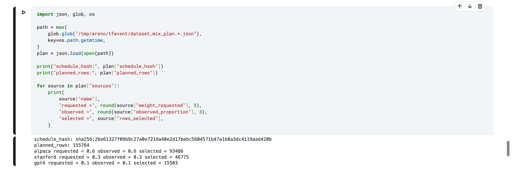

   Structured plan inspection showing the schedule hash, 155,764 planned
   rows, and requested, planned, and selected values for all three sources.

7. Verify deterministic replay
------------------------------

The 128-token run, 256-token run, and 500-step run all used the same source
contract and produced:

.. code-block:: text

   mix_spec_hash:
   sha256:fda6d7cbdab898b0ddafb6e6f37fa6c81b581da73b4bde7ebdfda8a0438057b4

   schedule_hash:
   sha256:26e61327f09b9c27a0e7219a40e2d17bebc5604571b47a1b8a3dc4119aad420b

Token limits do not participate in source scheduling, so changing 128 to 256
tokens must not change either hash. Compare all saved plans:

.. code-block:: python

   import glob
   import json
   import os

   for path in sorted(
       glob.glob("/tmp/areno/tfevent/dataset_mix_plan.*.json"),
       key=os.path.getmtime,
   ):
       with open(path, encoding="utf-8") as handle:
           plan = json.load(handle)
       print(os.path.basename(path), plan["schedule_hash"])

The structured-plan figure and the final 500-step summary below both report
``sha256:26e61327f09b9c27a0e7219a40e2d17bebc5604571b47a1b8a3dc4119aad420b``.
Together with the matching plan artifacts observed in the intervening
256-token run,
this verifies that token limits and step count did not alter the schedule.

8. Compare token-limit filtering
--------------------------------

Before the final run, two 50-step runs compared 128-token and 256-token
prompt/response budgets. They used the command from section 5 with
``--max-steps 50`` and, respectively:

.. code-block:: bash

   --max-prompt-tokens 128 --max-new-tokens 128

.. code-block:: bash

   --max-prompt-tokens 256 --max-new-tokens 256

.. list-table::
   :header-rows: 1
   :widths: 32 22 22

   * - Metric
     - 128 / 128
     - 256 / 256
   * - Scheduled rows
     - 165
     - 117
   * - Filtered rows
     - 65
     - 17
   * - Filter rate
     - 39.39%
     - 14.53%
   * - Trained rows
     - 100
     - 100
   * - Target tokens trained
     - 4,455
     - 8,295
   * - Target tokens per trained row
     - 44.55
     - 82.95

The 256-token configuration reduced filtering by 24.86 percentage points and
nearly doubled the supervised target-token volume without destabilizing the
two-GPU tensor-parallel run. It was therefore selected for the 500-step
validation.

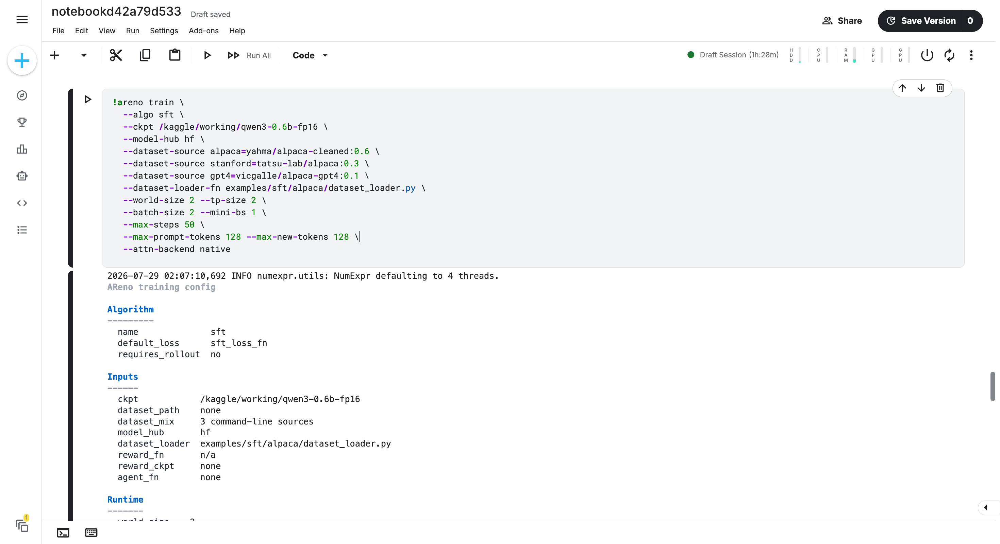

   First validation command: 50 steps with 128 prompt tokens and 128 response
   tokens. The resolved input summary confirms that three command-line sources
   were selected.

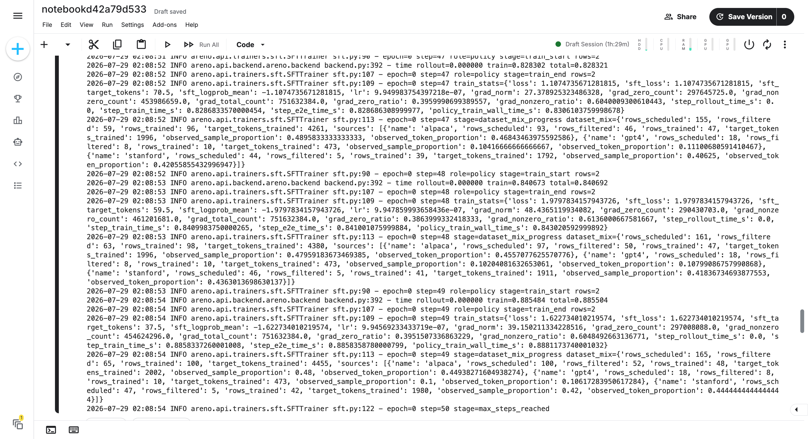

   Final 128-token progress. The run reached 50 steps after scheduling 165
   rows, filtering 65, and training 100.

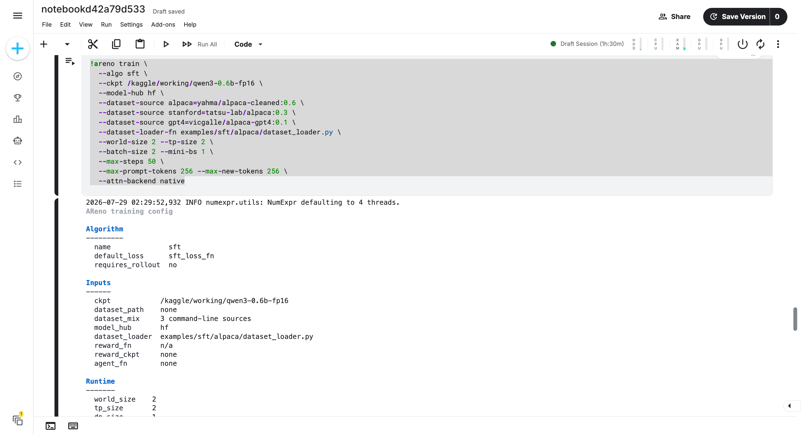

   Second validation command: the same 50-step run with both token limits
   raised to 256. All dataset-source and runtime settings remain unchanged.

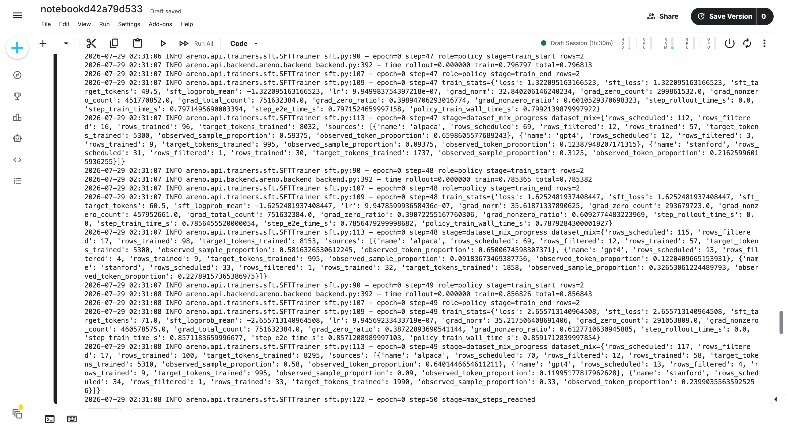

   Final 256-token progress. The run reached 50 steps after scheduling 117
   rows, filtering 17, and training 100.

9. Inspect the 500-step result
------------------------------

The final progress event reported:

.. list-table::
   :header-rows: 1
   :widths: 34 22

   * - Metric
     - Result
   * - Optimizer steps
     - 500
   * - Scheduled rows consumed
     - 1,171
   * - Filtered rows
     - 171
   * - Overall filter rate
     - 14.60%
   * - Trained rows
     - 1,000
   * - Target tokens trained
     - 77,533
   * - Mean target tokens per trained row
     - 77.533
   * - Final completion stage
     - ``max_steps_reached``

Per-source effective contribution was:

.. list-table::
   :header-rows: 1
   :widths: 16 16 16 16 18 18

   * - Source
     - Scheduled
     - Filtered
     - Trained
     - Trained share
     - Token share
   * - ``alpaca``
     - 675
     - 142
     - 533
     - 53.3%
     - 62.32%
   * - ``stanford``
     - 366
     - 5
     - 361
     - 36.1%
     - 24.92%
   * - ``gpt4``
     - 130
     - 24
     - 106
     - 10.6%
     - 12.76%

The source acceptance rates differ: Stanford Alpaca filtered fewer rows than
the other two sources. This explains why trained-row proportions differ from
scheduled sample weights. Token proportions differ again because accepted
response lengths are source-dependent. The progress event makes both effects
observable rather than silently claiming that scheduled weights equal loss
contribution.

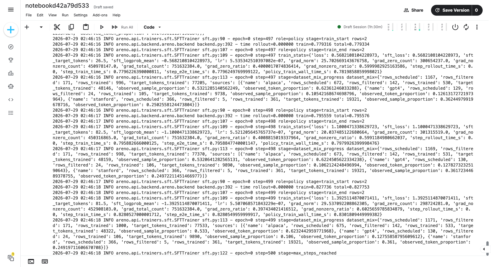

   The final 500-step log contains step 499 training statistics, source-level
   mixing progress, and ``step=500 stage=max_steps_reached``. It is the
   evidence for scheduled, filtered, trained, and token counts after
   token-length filtering.

10. Evaluate training stability
-------------------------------

Single-batch loss is noisy because batch size is two, so windowed statistics
are more informative than comparing only step zero and step 499.

.. list-table::
   :header-rows: 1
   :widths: 34 22 22

   * - Metric
     - First 50 steps
     - Last 50 steps
   * - Mean loss
     - 2.088
     - 1.530
   * - Median loss
     - 2.009
     - 1.521
   * - Mean gradient norm
     - 44.90
     - 26.92
   * - Mean train time per step
     - 0.927 s
     - 0.792 s

The first-to-last window mean loss decreased by approximately 26.7%. All
reported losses, gradients, learning rates, and timings remained finite. This
supports execution stability, but it must not be presented as a downstream
quality benchmark because no held-out evaluation set was used.

The following notebook cell generated the compact final validation. It selects
the event file with the most recorded loss points, associates it with the
matching process-specific run state, configuration, and mix plan, and then
checks the 500-step completion contract:

.. code-block:: python

   from pathlib import Path
   from statistics import mean
   from tensorboard.backend.event_processing.event_accumulator import (
       EventAccumulator,
   )
   import json
   import math

   log_dir = Path("/tmp/areno/tfevent")
   runs = []

   for event_file in log_dir.rglob("events.out.tfevents.*"):
       try:
           accumulator = EventAccumulator(
               str(event_file),
               size_guidance={"scalars": 0},
           )
           accumulator.Reload()
           tags = accumulator.Tags().get("scalars", [])
           if "train/loss" in tags:
               runs.append(
                   (
                       len(accumulator.Scalars("train/loss")),
                       event_file,
                       accumulator,
                   )
               )
       except Exception:
           pass

   if not runs:
       raise RuntimeError(f"No training events found under {log_dir}")

   steps_recorded, event_file, accumulator = max(
       runs,
       key=lambda item: item[0],
   )

   pid = None
   for state_path in log_dir.glob("dashboard_state.*.json"):
       candidate_pid = state_path.stem.split(".")[-1]
       if f".{candidate_pid}." in event_file.name:
           pid = candidate_pid
           break

   if pid is None:
       state_path = max(
           log_dir.glob("dashboard_state.*.json"),
           key=lambda path: path.stat().st_mtime,
       )
       pid = state_path.stem.split(".")[-1]
   else:
       state_path = log_dir / f"dashboard_state.{pid}.json"

   config_path = log_dir / f"areno_run_config.{pid}.json"
   plan_path = log_dir / f"dataset_mix_plan.{pid}.json"

   with state_path.open(encoding="utf-8") as handle:
       state = json.load(handle)
   with config_path.open(encoding="utf-8") as handle:
       config = json.load(handle)
   with plan_path.open(encoding="utf-8") as handle:
       plan = json.load(handle)

   settings = {
       item["key"]: item["value"]
       for section in config["settings"]["sections"]
       for item in section["items"]
   }

   def scalar_values(tag):
       return [
           float(event.value)
           for event in accumulator.Scalars(tag)
       ]

   tags = accumulator.Tags()["scalars"]
   loss = scalar_values("train/loss")
   grad_norm = scalar_values("train/grad_norm")
   target_tokens_mean = scalar_values("train/sft_target_tokens")
   time_tag = (
       "train/step_train_time_s"
       if "train/step_train_time_s" in tags
       else "time/train"
   )
   train_time = scalar_values(time_tag)

   batch_size = int(settings["batch_size"])
   max_steps = int(settings["max_steps"])
   first_loss = mean(loss[:50])
   last_loss = mean(loss[-50:])
   loss_change = (last_loss / first_loss - 1) * 100

   print("=== AReno third-run validation ===")
   print("event_file:", event_file.name)
   print("run_stage:", state.get("stage"))
   print("state_step:", state.get("step"))
   print("configured_max_steps:", max_steps)
   print("steps_recorded:", steps_recorded)
   print("batch_size:", batch_size)
   print("trained_rows:", steps_recorded * batch_size)
   print(
       "target_tokens_trained:",
       round(sum(target_tokens_mean) * batch_size),
   )

   print("\n=== Training metrics ===")
   print("first_50_loss_mean:", round(first_loss, 6))
   print("last_50_loss_mean:", round(last_loss, 6))
   print("loss_mean_change:", f"{loss_change:.2f}%")
   print("final_step_loss:", round(loss[-1], 6))
   print(
       "first_50_grad_norm_mean:",
       round(mean(grad_norm[:50]), 6),
   )
   print(
       "last_50_grad_norm_mean:",
       round(mean(grad_norm[-50:]), 6),
   )
   print(
       "overall_train_time_mean_s:",
       round(mean(train_time), 6),
   )
   print(
       "last_50_train_time_mean_s:",
       round(mean(train_time[-50:]), 6),
   )

   print("\n=== Dataset mixing plan ===")
   print("schedule_hash:", plan["schedule_hash"])
   print("planned_rows:", plan["planned_rows"])
   for source in plan["sources"]:
       print(
           source["name"],
           "requested =", round(source["weight_requested"], 3),
           "planned =", round(source["observed_proportion"], 3),
           "selected =", source["rows_selected"],
       )

   passed = (
       state.get("stage") == "max_steps_reached"
       and state.get("step") == max_steps
       and steps_recorded == max_steps
       and len(target_tokens_mean) == max_steps
       and all(math.isfinite(value) for value in loss)
   )
   print("\nVALIDATION:", "PASS" if passed else "FAIL")

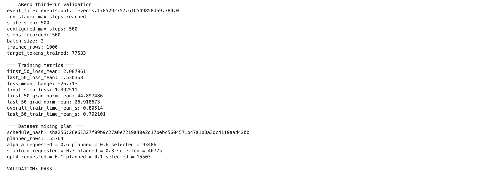

   Programmatic inspection of the TensorBoard event file and matching
   run-state artifacts. It confirms all 500 recorded steps, 1,000 trained
   rows, 77,533 target tokens, a 26.71% first-to-last-window mean loss
   decrease, the expected schedule hash, finite metrics, and
   ``VALIDATION: PASS``. The 60/30/10 values shown here are pre-filter plan
   proportions; the effective post-filter shares are reported in the previous
   figure and table.

Evidence checklist
------------------

The retained submission contains these twelve screenshots:

#. ``kaggle-01-source-revision.png`` — branch checkout and implementation SHA;
#. ``kaggle-02-environment.png`` — PyTorch, CUDA, GPU, and extension import;
#. ``kaggle-03-model-preparation.png`` — FP16 conversion cell;
#. ``kaggle-04-fp16-checkpoint.png`` — completed model write and dtype;
#. ``kaggle-05-token-limit-128-config.png`` — first-run command and config;
#. ``kaggle-06-token-limit-128-result.png`` — first-run final progress;
#. ``kaggle-07-structured-plan.png`` — schedule hash and planned source counts;
#. ``kaggle-08-token-limit-256-config.png`` — second-run command and config;
#. ``kaggle-09-token-limit-256-result.png`` — second-run final progress;
#. ``kaggle-10-500-step-config.png`` — third-run command and config;
#. ``kaggle-11-500-step-result.png`` — third-run source progress and completion;
#. ``kaggle-12-500-step-summary.png`` — TensorBoard and artifact validation.

All images are stored under ``docs/_static/kaggle-dataset-mixing/`` as
lossless PNG files. The pair of final-run images is intentional: the raw log
proves effective per-source contribution, while the compact summary verifies
the complete 500-step metric series and pre-filter schedule.

Artifacts and retained evidence
-------------------------------

The feature produces or references:

* ``dataset_mix_plan.<pid>.json`` — sample-free source plan and hashes;
* ``areno_run_config.<pid>.json`` — resolved run configuration;
* ``areno_run_config.<pid>.txt`` — human-readable run configuration;
* TensorBoard event files under the metrics directory;
* notebook output containing plan, progress, train statistics, and completion.

The validation intentionally did not retain a model checkpoint. A future
quality-evaluation run should configure ``--save-path`` and record the saved
checkpoint location and size separately.

Known limitations
-----------------

* V1 supports map-style datasets; streaming datasets are not accepted.
* The epoch index schedule is precomputed, so memory grows with planned rows.
* Weights are sample-based and apply before tokenization/length filtering.
* Source-specific filtering can change effective trained-row proportions.
* Source-specific response lengths can change target-token/loss contribution.
* The schedule hash covers source names and selected indices, not immutable
  verification of remote dataset contents.
* Exact deterministic replay starts at an epoch boundary. Mid-epoch optimizer
  state and dataset-cursor resume are outside the current contract.
* The Kaggle run validates two-GPU tensor-parallel SFT. It does not validate
  multi-node execution, data parallelism, or model-quality generalization.
