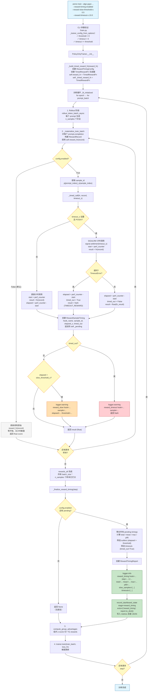

# Reward Hook Timing — Flow Diagram (Issue #242)

```mermaid
flowchart TD
    %% ─── CLI 启动阶段 ───
    CLI["areno train --algo gspo ...<br/>--reward-timing-enabled<br/>--reward-slow-threshold-s 0.5<br/>--reward-timeout-s 10.0"]
    VAL["CLI 参数验证<br/>（train.py _trainer_config_from_options）<br/>✓ threshold > 0<br/>✓ timeout > 0<br/>✓ timeout >= threshold"]
    CLI --> VAL

    %% ─── Trainer 初始化 ───
    INIT["PolicyOnlyTrainer.__init__"]
    BUILD["_build_timed_reward_fn(reward_fn)<br/>创建 RewardTimingConfig<br/>创建 TimedRewardFn 包装器<br/>self.reward_fn = TimedRewardFn<br/>self._timed_reward_fn = TimedRewardFn"]
    VAL --> INIT
    INIT --> BUILD

    %% ─── 训练循环 ───
    LOOP["训练循环 _fit_initialized<br/>for epoch → for prompt_batch"]
    BUILD --> LOOP

    %% ─── Rollout ───
    ROLLOUT["1. Rollout 阶段<br/>rollout_token_batch_async<br/>每个 prompt 生成 n_samples 个补全"]
    LOOP --> ROLLOUT

    %% ─── Reward 打分 ───
    MATERIALIZE["2. _materialize_train_batch<br/>对每个 prompt,completion 构建 RewardRecord<br/>调用 self.reward_fn(record)"]
    ROLLOUT --> MATERIALIZE

    %% ─── TimedRewardFn.__call__ ───
    CHECK{"config.enabled?"}
    MATERIALIZE --> CHECK

    %% ─── 禁用路径 ───
    DISABLED["直接调用原始 reward_fn(record)<br/>零开销，无计时数据<br/>返回 float score"]
    CHECK -- "False (默认)" --> DISABLED

    %% ─── 启用路径 ───
    ENABLED["提取 sample_id<br/>p{prompt_index}_s{sample_index}"]
    CHECK -- "True" --> ENABLED

    TIMED_CALL["_timed_call(fn, record, timeout_s)"]
    ENABLED --> TIMED_CALL

    %% ─── 超时判断 ───
    HAS_ALARM{"timeout_s 设置<br/>且 POSIX?"}
    TIMED_CALL --> HAS_ALARM

    NO_ALARM["直接计时调用<br/>start = perf_counter<br/>result = fn(record)<br/>elapsed = perf_counter - start"]
    HAS_ALARM -- "否" --> NO_ALARM

    WITH_ALARM["SIGALRM 计时调用<br/>signal.setitimer(timeout_s)<br/>start = perf_counter<br/>result = fn(record)"]
    HAS_ALARM -- "是" --> WITH_ALARM

    %% ─── 超时结果 ───
    TIMEOUT_HIT{"超时?<br/>TimeoutError?"}
    WITH_ALARM --> TIMEOUT_HIT
    NO_ALARM --> STORE

    TIMEOUT_RESULT["elapsed = perf_counter - start<br/>timed_out = True<br/>result = NaN (TIMEOUT_REWARD)"]
    TIMEOUT_HIT -- "是" --> TIMEOUT_RESULT

    NORMAL_RESULT["elapsed = perf_counter - start<br/>timed_out = False<br/>result = float(fn_result)"]
    TIMEOUT_HIT -- "否" --> NORMAL_RESULT

    %% ─── 存储 timing ───
    STORE["创建 RewardSampleTiming<br/>hook_name, sample_id, elapsed_s, timed_out<br/>追加到 self._pending"]
    TIMEOUT_RESULT --> STORE
    NORMAL_RESULT --> STORE

    %% ─── 超时处理 ───
    IS_TIMEOUT{"timed_out?"}
    STORE --> IS_TIMEOUT

    LOG_TIMEOUT["logger.warning<br/>reward_timeout hook=... sample=...<br/>返回 NaN"]
    IS_TIMEOUT -- "是" --> LOG_TIMEOUT

    %% ─── 慢样本检查 ───
    SLOW_CHECK{"elapsed > slow_threshold_s?"}
    IS_TIMEOUT -- "否" --> SLOW_CHECK

    LOG_SLOW["logger.warning<br/>reward_slow hook=... sample=...<br/>elapsed=... threshold=..."]
    SLOW_CHECK -- "是" --> LOG_SLOW

    RETURN_RESULT["返回 result (float)"]
    SLOW_CHECK -- "否" --> RETURN_RESULT
    LOG_SLOW --> RETURN_RESULT
    LOG_TIMEOUT --> RETURN_RESULT

    %% ─── 循环回到下一个样本 ───
    NEXT_SAMPLE{"还有更多<br/>样本?"}
    DISABLED --> NEXT_SAMPLE
    RETURN_RESULT --> NEXT_SAMPLE
    NEXT_SAMPLE -- "是" --> MATERIALIZE

    %% ─── 所有 reward 打分完成 ───
    ALL_DONE["rewards_all 完成<br/>所有 batch_size * n_samples 个样本已打分"]
    NEXT_SAMPLE -- "否" --> ALL_DONE

    %% ─── Finalize ───
    FINALIZE["_finalize_reward_timing(step)"]
    ALL_DONE --> FINALIZE

    FB_CHECK{"config.enabled<br/>且有 pending?"}
    FINALIZE --> FB_CHECK

    FB_NONE["返回 None<br/>（无报告）"]
    FB_CHECK -- "否" --> FB_NONE

    FB_AGG["聚合所有 pending timings<br/>计算 total / mean / max / p95<br/>筛选 outliers (elapsed > threshold)<br/>筛选 timeouts (timed_out=True)"]
    FB_CHECK -- "是" --> FB_AGG

    %% ─── 报告输出 ───
    REPORT["创建 RewardTimingReport"]
    FB_AGG --> REPORT

    LOG_SUMMARY["logger.info<br/>reward_timing hook=... step=... n=...<br/>total=... mean=... max=... p95=...<br/>slow_samples=[...] timeouts=[...]"]
    REPORT --> LOG_SUMMARY

    DASHBOARD["record_dashboard_state<br/>stage=reward_timing<br/>extra={'reward_timing': report.to_dict()}<br/>写入 metrics 目录 JSON"]
    LOG_SUMMARY --> DASHBOARD

    %% ─── 继续训练 ───
    ADVANTAGE["3. compute_group_advantages<br/>组内 z-score 归一化 rewards"]
    FB_NONE --> ADVANTAGE
    DASHBOARD --> ADVANTAGE

    TRAIN["4. trainer.train(train_batch, loss_fn)<br/>梯度更新"]
    ADVANTAGE --> TRAIN

    NEXT_STEP{"还有更多<br/>step?"}
    TRAIN --> NEXT_STEP
    NEXT_STEP -- "是" --> LOOP

    DONE["训练完成"]
    NEXT_STEP -- "否" --> DONE

    %% ─── 样式 ───
    style CLI fill:#e1f5fe,stroke:#01579b
    style CHECK fill:#fff9c4,stroke:#f57f17
    style HAS_ALARM fill:#fff9c4,stroke:#f57f17
    style TIMEOUT_HIT fill:#fff9c4,stroke:#f57f17
    style IS_TIMEOUT fill:#fff9c4,stroke:#f57f17
    style SLOW_CHECK fill:#fff9c4,stroke:#f57f17
    style FB_CHECK fill:#fff9c4,stroke:#f57f17
    style NEXT_SAMPLE fill:#fff9c4,stroke:#f57f17
    style NEXT_STEP fill:#fff9c4,stroke:#f57f17
    style LOG_TIMEOUT fill:#ffcdd2,stroke:#b71c1c
    style LOG_SLOW fill:#ffe0b2,stroke:#e65100
    style LOG_SUMMARY fill:#c8e6c9,stroke:#1b5e20
    style DASHBOARD fill:#c8e6c9,stroke:#1b5e20
    style DISABLED fill:#f5f5f5,stroke:#9e9e9e
    style DONE fill:#e1f5fe,stroke:#01579b
```