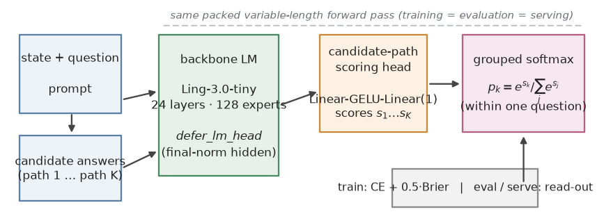
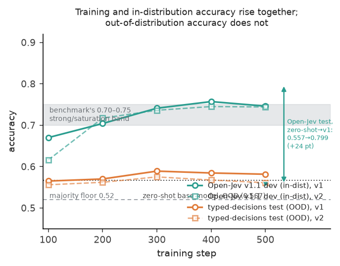
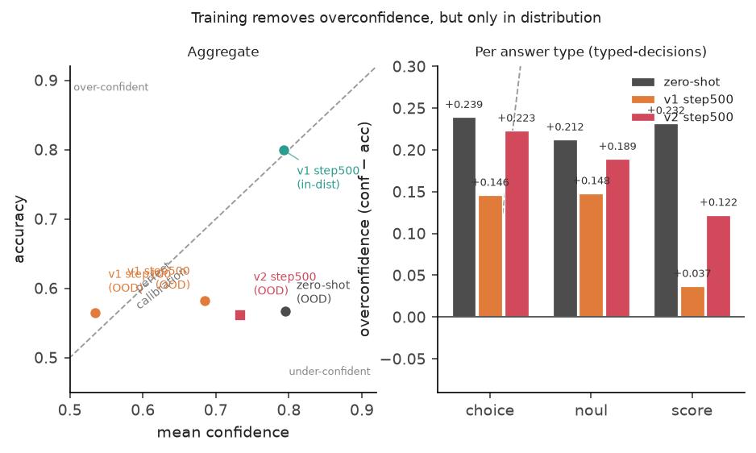
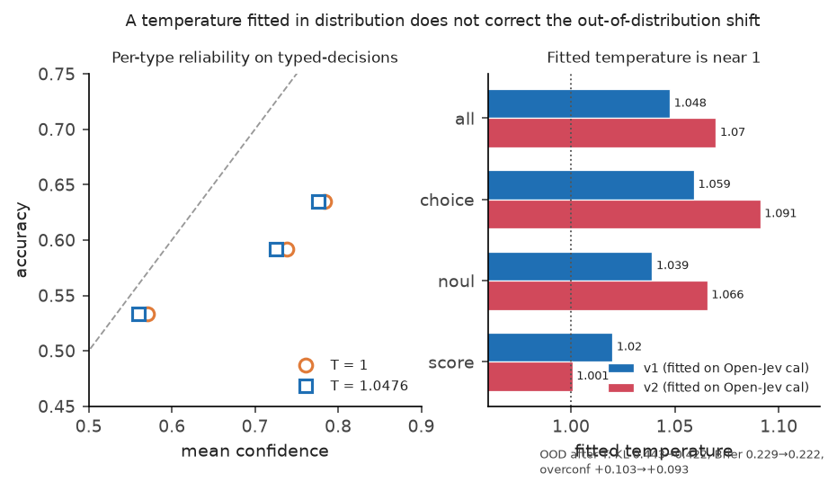
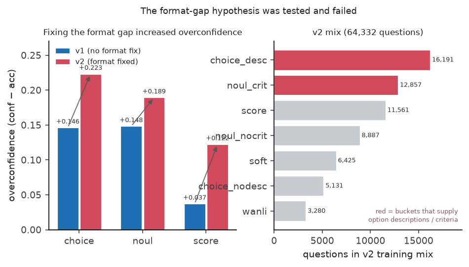
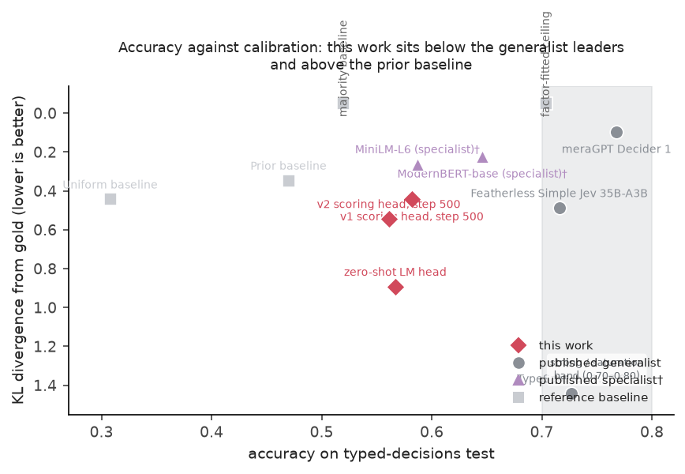

# 给单卡语言模型加一个可训练打分头：面向通用业务决策的实证

---

## 摘要

以 `typed-decisions` 为代表的评测集，要求模型通过一套类型化的接口（typed interface）回答自然语言描述的业务问题，涵盖选择题（choice）、判断题（noul）和打分题（score）三类。一个指令模型，能否不靠规模、而靠针对任务的训练，在这类评测上取得提升？目前尚无明确答案。

我们使用 AReno，基于 `Ling-3.0-tiny`，训练了一个 JevForge 风格的决策打分头（scoring head）。打分头是一个独立的小模块，用来替代标准的语言模型头：语言模型头预测"下一个 token 是什么"，而打分头读到某个候选答案后，输出的是"这个答案值多少分"。对同一道题的所有候选答案各打一个分后，这些分数经由分组 softmax 归一成一个分布，作为该题的决策；所用的损失是交叉熵与 Brier 项的组合。AReno 让训练与推理共用同一段打包变长前向（forward pass），因此不存在训推不一致（train-inference mismatch）。

我们在单台 NVIDIA DGX Spark（GB10，128 GB 统一内存）上完成了三组受控训练，外加一条零样本（zero-shot）基线。打分头在 `typed-decisions` test 上达到 0.582 准确率，和未训练的基座（base model）语言模型头的 0.567 统计上无显著差异（statistically indistinguishable）。训练没能提升准确率，但确实改善了校准（calibration）——即模型自称的把握与实际答对率是否对得上：KL 散度（KL divergence）从 0.893 降到 0.316–0.443，Brier 分数（Brier score）从 0.326 降到 0.178–0.229，过自信（overconfidence）从 +0.228 回落到 −0.030 到 +0.103 的区间。训练最确定的收益出现在同分布（in-distribution）上——Open-Jev v1.1 准确率提升了 24 个点。补上缺失的答案格式信息并无裨益；混入与目标不适配的评分数据源，反而使打分题准确率下降。

这些结果表明：在这份评测集上，这条微调路线的上限取决于基座模型自身的零样本决策能力，以及它与这份评测数据的教师（teacher）标注之间的一致性；其可靠价值在于校准，而非能力。

**关键词：** 决策打分、校准、参数高效微调、混合专家、大模型评测、分组 softmax

---

## 1. 引言

如今，让语言模型直接作出业务决策的场景正越来越多，而不只是生成自由文本。发票处理、安全事件研判、客服路由、agent 轨迹审查——这些场景里，模型接收一个结构化状态，要回答三类问题之一：选择题、判断题或打分题。`typed-decisions` 把这套设定固化成了评测数据与评分办法，是一套公开的评测，属于 Jev 决策评测家族。它包含 400 个 case、2000 个决策；当前榜单（leaderboard）上既有专用系统也有通用模型，从准确率 0.727 的 Jev 1.13，到接近 0.716 的通用条目。

我们带着两个问题开始这项工作。第一，紧凑模型能否不靠规模、仅凭针对任务的训练，就逼近榜单这一水平？第二，即便训练了，它到底改变了什么？一个决策模型至少有两条可能的改善路径：一条是更准确，另一条是更诚实。校准（calibration）说的就是这种"诚实"：模型对自己预测的置信度与其真实正确率的一致性——例如，模型对某答案给出 80% 的把握时，它是否真的以约 80% 的概率答对。这两个方向的实用价值不同，不可相互替代。

我们验证的路线与 JevForge 架构同构：一个基座模型，外加一个独立可训练的打分头——它替代语言模型头，为每条候选答案路径单独打一个分。该路线作为 AReno 的实验性"分类"算法实现，并应用于混合专家（mixture-of-experts，MoE）模型 `Ling-3.0-tiny`。随后我们在 `typed-decisions` 上做评测——这份评测对我们的训练数据完全留出（held-out），以严格零样本方式进行。我们的核心问题只有一个：在 `typed-decisions` 上，训练候选路径打分头能否超越基座模型自身的零样本能力？

为了回答这个问题，我们在完全相同的超参数下比较三组设置。第一组用 Open-Jev v1.1 的数据来训练；第二组保留第一组的超参，只补上第一组缺失的答案格式信息；第三组是零样本基线，直接用基座模型的语言模型头作答。我们分离各因素的影响，并报告每个存档点（checkpoint）的校准行为。我们还验证过：本地评测能精确复现公开榜单的 uniform 基线；同时也筛查了训练数据和测试集之间可能存在的重叠。

---

## 2. 相关工作

我们要研究的这套评测，背后是一条近期的研究思路：把语言模型评测从"猜标签"，重新定义成"给带类型的概率决策打分"。`typed-decisions` 是一套独立的评测，建立在 TypeSafe AI 所用的 System One 原语之上 [1]，围绕 `noul`（判断题）、`choice`（选择题）、`score`（打分题）三种题型设计 [2]。它有两个不太寻常的构造细节，会直接影响我们如何解读结果。

第一，gold 标签由约 4B 量级的教师接口以温度（temperature）0.7 采样三次后取平均得到。也就是说，得分衡量的不是回答是否正确，而是与教师标注的一致性。数据集卡片给出的参照为：多数类基线 0.520、拟合潜在生成因子的模型 0.704、教师自一致（self-consistency）0.735，饱和点约在 0.75 [2]。

第二，卡片明确说明：即便模型在教师答错处答对，也会被扣分；各题的上限差异很大，从 `agent_trace/urgency` 的 0.560 到 `customer_service/category` 的 0.937 [2]。我们的评测继承了这两点性质，其影响留到第 5 节讨论。

这套评测把模型分成两类：通用模型（generalist），零样本回答任意问题；专用模型（specialist），按工作流拟合、标签空间固定。它明确指出，这两类不可直接比较 [2]。已经公开的通用条目有：准确率 0.727 的 TypeSafe Jev 1.13.0、0.716 的 Featherless Simple Jev，还有专有的 meraGPT Decider 1（0.768）[2,3,4]。专用条目则有按工作流分别拟合的 ModernBERT-base（0.646）和 MiniLM-L6（0.587）[2,5,6]。本文属于前一种——通用评测：模型在其他工作流上训练过，随后以零样本方式直接应用，因此我们只与通用条目比较。

"共享归一化"的候选路径打分，和分类、语言建模里的分组 softmax 目标有关 [7]，也和信息检索、推荐里的 listwise 排序目标有关——后者会对同一查询下的候选做联合打分。我们显式地采用分组：同一道题的候选答案，共用一个 softmax。正是这个性质，让打分头成为决策模型，而不是一组各自独立的 token 分类器；也正是它，让交叉熵和 Brier 损失能在同一个候选单纯形上同时良好定义。

Brier 分数来自概率预测领域 [8]，把它与交叉熵这类"严格恰当评分规则"（strictly proper scoring rule）组合使用，是评估概率预测的标准做法 [9]。神经网络的置信度校准是一个长期存在的问题 [10]，事后温度缩放（temperature scaling）是普遍采用且有效的补救手段 [11]。本文与纯粹的校准研究有两点不同：第一，我们研究可训练打分头在训练过程中如何改变校准，而不只是应用一次事后修正；第二，我们还检验了在同分布上拟合出来的温度能否迁移到分布外（out-of-distribution）的决策评测上。

对指令微调（instruction tuning）语言模型做监督微调（supervised fine-tuning，SFT），是任务适配的标准做法 [12]，LoRA 这类参数高效（parameter-efficient）变体把成本降了下来 [13]。但这套做法的收益，取决于目标任务与预训练分布之间的距离；在同分布集合上拿到的增益，未必能迁移到分布不同的留出集合上 [14]。我们的设计正针对这一顾虑：将同分布指标（Open-Jev）与分布外指标（`typed-decisions`）分开、同时报告。

从更强的教师蒸馏（distillation）软标签（soft labels），是将学生仅凭硬标签无法获得的知识迁移过来的成熟做法 [15]，也是为紧凑基座模型补上其自身所缺的决策知识时，最自然的候选方案。本文未测试蒸馏，但在第 5 节，我们把它列为唯一可能改写上述"上限"结论的路线。

另外，`Ling-3.0-tiny` 这种混合专家模型还多一层考虑。稀疏路由（sparse routing）对输入分布很敏感，一个会改变输入分布的适配过程，可能以稠密模型不会有的方式改变模型 [16]。所以我们只报告这条路线在这一个模型族上观察到的局限，不做跨架构推广。

---

## 3. 方法

### 3.1 任务形式化

一个任务实例，把一个业务状态 `state` 和一道问题配在一起。问题分三类：`choice` 选择题——对若干带描述的选项给出一个软概率分布，不要求 one-hot；`noul`（no-utility-label）判断题——答案就是 true 或 false；`score` 打分题——在有序等级上给出分布，以期望等级评估。问题还可以带 `criteria`，说明答案应如何评判。

对每道题，我们先把 state 和问题拼成 prompt，再把每个候选答案渲染成"prompt + 答案标记 + 候选文本"。模型对每条候选路径打一个分，同一道题的所有候选分数放在一起归一化。这一形式化同时给出了监督信号与评测流程。

### 3.2 总体设计

系统由四部分组成，全部共用同一段前向：基座模型、替代语言模型头的可训练打分头、分组 softmax 损失，以及复用同一份代码的评测和服务路径。图 1 是整体流程。设计上，训练、评测与服务直接复用 AReno 的同一段前向，训推不一致（train-inference mismatch）因此无从混淆比较结论。

**图 1 | 打分头流程。** 业务 state 和问题渲染成 prompt；每条候选答案路径接着追加答案标记并分词。基座模型先推迟语言模型头，输出 final-norm 隐状态（hidden states）；打分头对每条路径做末 token 池化（last-token pooling）。同一道题的候选分数共用一个 softmax，得到一个分布：训练时拿它跟目标分布比，评测和服务时从它读出选择题、判断题或打分题的答案。三个阶段用的都是同一段打包变长前向。



### 3.3 候选路径打分头

打分头是一个小型多层感知机（multi-layer perceptron，MLP）：`Linear(1536,1536) − GELU − Linear(1)`。它读取每条候选路径末 token 的 final-norm 隐状态（即末 token 池化），为每条路径返回一个标量分数，架构遵循 JevForge 参考实现 [28]。为什么需要它？语言模型头是在整个词表上预测下一个 token，用它比较完整候选路径的对错，本质上就是一种错误的归纳偏置。只读路径末 token、投影成一个标量，得到的才是能与同题其他候选直接比较的逐候选分数。

基座模型以 `defer_lm_head=True` 调用，直接跳过语言模型头。打分头用固定随机种子初始化，保证多个数据并行 rank 之间一致，保存为 `score_head.safetensors`，键是 `0.weight`、`0.bias`、`2.weight`、`2.bias`。在我们引擎中，推迟语言模型头已为四个模型族实现；这一实现的边界，也就界定了打分头可挂载与不可挂载的基座模型。

### 3.4 分组 softmax 目标

对一道含若干候选分数的问题，我们在其候选集合内部计算分组 softmax（grouped softmax），而不是在整个 batch 上统一计算。实现上用 `scatter_reduce` 求最大值、`index_add` 做归一化，这样既能保证分段计算精确，又不依赖候选的先后顺序。逐问题损失由两部分组成：对目标分布的交叉熵，加上加权后的 Brier 项：

`L = CE + brier_weight * Brier`，

其中 `brier_weight` 取 0.5。交叉熵单独使用时可以容忍一定程度的校准偏差；Brier 项专门惩罚这类被交叉熵容忍掉的偏差所对应的概率质量错置。打包时产生的不属于任何问题的行，会被赋上组索引 −1、排除在损失之外，同时保留住计算图的锚点。

选分组 softmax 是有意为之。如果各候选单独打分，模型表达的置信度，可能和它实际要面对的"备选项集合"对不上——这与决策任务的性质不符。分组 softmax 让同一道题的候选共享一个归一化，输出才是真实备选项上的一个恰当分布，交叉熵和 Brier 也才能在同一单纯形上定义良好。

### 3.5 步组织与打包

一道题绝不能跨 microbatch、也不能跨数据并行 rank 切开，否则分组 softmax 就被破坏了。训练器按 token 数大致递减排序，把问题打包（packing）成一步，让每个 microbatch 的 token 数贴近目标且无需 padding。在 AReno 中，训练和推理用同一套打包变长序列，因此训推完全一致。

梯度先按问题权重归一化，再做数据并行和 microbatch 的平均，这样最终的更新相当于对"所有问题"取均值，而不是对 microbatch 取均值。这个细节很重要——因为不同问题的 token 数差别很大。

### 3.6 优化设置

学习率我们分成两档。基座模型用 2e-5，余弦衰减到零；打分头用 2e-4，配 12 步、仅作用于打分头的 warmup。warmup 期间基座模型的学习率是 0，但 AdamW 的动量还是照常累积。训练配置：4-bit AdamW、8000 token 的 microbatch、`MAX_LEN=1536`、flash attention，随机种子 17。每次训练 500 步、每步 32 道题，每 100 步存一次档。

### 3.7 评测口径

评测经由 `SequenceScorer` 适配器，使用与训练相同的打包前向，`MAX_LEN=1536`。我们报告这些指标：准确率、交叉熵、Kullback-Leibler 散度 `KL(gold||pred)`、总变差距离（total variation，TV）、Brier 分数、平均置信度（`conf`）、过自信（`overconf = conf − acc`），以及 10 桶的期望校准误差（expected calibration error，ECE）。

`typed-decisions` test 集包含 400 个 case、2000 个决策，采用 Apache-2.0 许可，已随本仓库一同分发（vendored）[2]。每个 case 在一个共享的 JSON state 上提出五道问题，覆盖四个工作流：`agent_trace_observability`、`customer_service`、`invoice_processing` 和 `security_incidents`。我们把它当作零样本通用评测，只和通用榜单条目比较。gold 标签来自约 4B 量级的教师接口，温度 0.7 采样三次取均值，所以得分衡量的同样是回答与教师标注的一致性，而非回答本身的正确性。数据集卡片报告：多数类下限 0.520、因子拟合上限 0.704、教师自一致 0.735、饱和点约 0.75 [2]。

我们的 `evaluate.py` 能精确复现公开的 uniform（均匀）基线——对所有候选一视同仁地分配概率——KL 0.444、TV 0.381、Brier 0.238，所以这三列与榜单口径一致；对不产生并列（tie）的模型，准确率也对得上。Prior（先验）基线未能精确复现，差异在 0.01 到 0.09，因此只作参考。温度只在 Open-Jev 的 calibration split 上拟合，从不在 `typed-decisions` 上拟合。

有两项溯源上的局限，我们如实说明。指导 `MAX_LEN` 设定的长度分析在实验期间有记录，但脚本输出未保留，故这些数字无法独立复核。同样，一项数据泄漏（data leakage）筛查——用字面匹配加 Jaccard 近似，把 Open-Jev v1.1、Open-Jev v1 和 `typed-decisions` test 互相比对——没有发现重合；筛查同时发现，JevEmbed-Data 中 `system_one_270m` 的 400 段内容与 test 的 criteria 完全相同，该数据源因此被排除。排除决定记录在 `convert_datasets.py:JEVEMBED_SOURCES` 中，但筛查脚本本身未保留，因此这一步同样无法独立复核。

### 3.8 实现

改动分三层，都落在 `feat/classify-jev` 分支的十个提交里。引擎层：新增 `areno/engine/score_head.py`，含 `build_score_head`、`attach_score_head`、`packed_sequence_scores`、`save_score_head`；给 `RuntimeConfig` 加了 `score_head` 开关；扩展 `TrainSequence` 和 `make_train_pack` 携带 `sequence_labels`；给四个模型族加了 `defer_lm_head`。算法层：用 `register_algorithm` 注册 `classify` 算法，而非修改工厂（这符合仓库的扩展规则）；新增 `grouped_softmax_loss` 和 `ClassifyTrainer`，后者负责编码、整题打包、数据并行交错和权重归一化。示例层：新增记录加载器、数据集转换器、vendored 的 `typed-decisions`、训练和评测脚本、温度拟合脚本、decisions API 服务，以及 JevForge 导出脚本。

过程中发现并处理了三个问题。Ling 官方模型定义基于 transformers 4.45，到 5.15 及以上版本导入就会失败——因为 `is_torch_fx_available` 在导入期不可用——所以评测和服务都改用我们自己的适配器。FastAPI 服务刻意不写 `from __future__ import annotations`，因为该 future import 会破坏 FastAPI 对运行时注解的解析。还有一个引擎测试把四卡配置写死了，在单卡机器上会失败；这与本工作无关，CPU 测试套件是在 `CUDA_VISIBLE_DEVICES=` 置空的情况下跑的。复现命令和产物路径见附录 A。

---

## 4. 实验

### 4.1 设置与冒烟测试

全部实验在一台 NVIDIA DGX Spark 上完成：单卡 GB10、128 GB 统一内存、单进程（`--world-size 1 --tp-size 1`）。基座为 `bailing_hybrid` 配置的 `Ling-3.0-tiny`：24 层、128 专家、top-8 路由加 1 个共享专家（shared expert）、MLA 与 KDA 注意力 [17]、1536 隐层维度 [27]。训练使用 4-bit AdamW [24,25] 与 flash attention [26]。

我们先在合成数据上做冒烟测试（smoke test）——按钮颜色的选择题任务与是否完成的判断题任务，共 256 条训练记录、40 条开发记录——确认从编码、打分头、分组 softmax、存档、打包推理到 decisions API 的整条链路能端到端（end-to-end）运行。结果：训练 20 步后交叉熵从 0.81 降至接近 0，无显存溢出，开发准确率达 1.000，API 对三类题目均返回有效结果，首个请求含预热约 1 秒。需要说明，此测试仅证明链路可运行，不构成任何能力结论。

### 4.2 同超参下的训练组

我们一共训练了三个模型。v1 组以 Open-Jev v1.1 为唯一数据源：147,139 道训练题，其中约 8.2 万条为 WANLI 的 NLI 数据 [18,19]。`open_jev_question` 源在处理选择题时，把选项文本本身当作选项描述；约 99% 的目标为 one-hot。在 Ling 分词器下做长度分析：最长候选路径的 p95 为 876 token、最大 1436 token，据此设定 `MAX_LEN=1536`——若取 512 会丢弃 32% 的样本。v1 训练 500 步，耗时 4.85 小时、约 37 秒/步；首尾各十步窗口的训练交叉熵从 1.2947 降至 0.5767。

v2 组保留 v1 的全部超参，只更换数据。这台机器无法访问 Hugging Face Hub（TLS 握手前超时、无代理），ModelScope 却可达 20.8 MB/s，因此所有数据均从 ModelScope 以固定 revision 下载并记录 SHA-256。v2 的混合包含三块：Open-Jev v1.1、采用 `id: description` 选项格式的 Open-Jev v1、以及通过审核的 JevEmbed-Data 白名单源 [20]；每个源都经过许可与数据污染（data contamination）两类白名单审核。混合由基于分桶（bucketing）的 water-filling（注水）混料器生成：64,332 道训练题，分布为 `choice_desc` 16,191、`choice_nodesc` 5,131、WANLI 3,280、`noul_crit` 12,857、`noul_nocrit` 8,887（其中 4,397 条注入了通用 criteria）、`score` 11,561、`soft` 6,425，无重复 id。v2 训练 500 步，耗时 5.88 小时、约 43 秒/步，首尾交叉熵窗口从 1.2545 降至 0.5418。

v3 组为零样本基线。我们不训练 `Ling-3.0-tiny`，直接用其语言模型头 [27] 作答，在构成合法答案的 token（选项字母、yes/no、等级数字）上重新归一化，并关闭思考模式。前缀探测（prefix probing）显示"不加前缀"最佳：合法答案 token 上的概率质量（label mass）：空前缀 0.9646、换行 0.8745、`Answer: ` 0.3902、换行加 `Answer: ` 0.3888。选择题（0.995）与打分题（0.994）上的 label mass 很高，唯独判断题只有 0.548——约 45% 的概率质量落在其他 token 上，如首字母大写的 `Yes`、`No`。因此零样本下判断题的估计很可能偏保守。

### 4.3 训练未提升 `typed-decisions` 准确率

在 `typed-decisions` test 上，训练后的打分头与未训练基座处于同一水平。零样本基线准确率 0.567，v1 在第 500 步达到 0.582。0.015 的差距在噪声范围以内：在 2000 个决策下、准确率约 0.58 时，标准误（standard error）约 0.011，且 v1 各存档点的范围为 0.565 至 0.589。因此训练并未明确提升该评测上的零样本准确率，也未缩小与最佳通用条目之间的差距。

表 1 把上述结果与公开通用条目并列。训练后的打分头位于 prior 基线与通用系统之间，但无论打分头还是其基座模型，都远低于准确率 0.727 的 Jev 1.13 和 0.716 的 Featherless 35B-A3B。图 2 在训练过程中呈现同一对比：同分布准确率稳步上升，分布外准确率保持平坦，与零样本基座相当。

**表 1 | `typed-decisions` test 上的准确率与校准，对照已公开通用条目。**

| 模型 / 阶段 | acc | KL | TV | Brier |
| --- | --- | --- | --- | --- |
| meraGPT Decider 1 | 0.768 | 0.096 | 0.149 | 0.052 |
| TypeSafe Jev 1.13.0 | 0.727 | 1.442 | 0.251 | 0.148 |
| Featherless Simple Jev (35B-A3B) | 0.716 | 0.488 | - | 0.176 |
| 教师自一致 | 0.735 | - | - | - |
| 因子拟合上限 | 0.704 | - | - | - |
| 零样本 LM head（本文） | 0.567 | 0.893 | 0.383 | 0.326 |
| v1 打分头，step 100 | 0.565 | 0.316 | 0.292 | 0.178 |
| v1 打分头，step 500 | 0.582 | 0.443 | 0.305 | 0.229 |
| v2 打分头，step 500 | 0.561 | 0.544 | 0.316 | 0.248 |
| Prior 基线 | 0.470 | 0.347 | 0.317 | 0.189 |
| Uniform 基线 | 0.308 | 0.444 | 0.381 | 0.238 |
| ModernBERT-base (149M)† | 0.646 | 0.223 | - | 0.119 |
| MiniLM-L6 (22M)† | 0.587 | 0.262 | - | 0.143 |



**图 2 | v1 与 v2 的准确率轨迹。** 每个点直接读自存档评测文件。同分布准确率（Open-Jev v1.1 dev）两次运行都保持上升；分布外准确率（typed-decisions test）则维持在 0.56 至 0.59 区间，与零样本基座（虚线，0.567）接近。第 500 步处的括号标出同分布 test split，v1 从零样本的 0.557 升至 0.799。阴影带标出数据卡片给出的 0.70 至 0.75 强/饱和参照区间。

`Prior 基线` 以上的行是已公开条目与评测参照；零样本、v1、v2 三行出自本研究。Uniform 行由我们的评测代码精确复现。带 † 的专用模型按工作流分别拟合、标签空间固定，与通用结果不可直接比较 [2]；此处仅用于界定同量级拟合分类器在这四个工作流上能达到的水平。

按题型拆分可以解释总体结果。相对零样本基线，v1 将打分题准确率从 0.482 提升至 0.534，选择题基本持平（0.592 对 0.588），判断题则从 0.658 略降至 0.635。三类方向不一、部分相互抵消，这与"总体差距属噪声而非一致增益"的判断一致。

### 4.4 训练改变的是校准

准确率虽未变化，输出分布的变化却很明显。v1 第 500 步，交叉熵从 0.893 降至 0.443，Brier 分数从 0.326 降至 0.229；第 100 步存档点分别达到 0.316 和 0.178。过自信从零样本基线的 +0.228 降至第 500 步的 +0.103、第 100 步的 −0.030。期望校准误差同样随训练下降，从 0.230 降至第 500 步的 0.106。

这条轨迹有两处值得注意。第一，校准最佳出现在训练早期，并随继续训练而恶化：第 100 步在 KL、Brier、过自信和 ECE 上均最优，而第 500 步准确率最高，但所有校准指标都更差。第二，训练所消除的校准偏差集中在分布外：第 500 步时，v1 在同分布 Open-Jev v1.1 test 上校准近乎完美（过自信 −0.006、ECE 0.018），在 `typed-decisions` 上却仍过自信（过自信 +0.103、ECE 0.106）。也就是说，第 500 步存档点像一个已经学会训练分布置信结构、又把它套用到另一分布上的模型。

这一模式同时说明损失不是问题根源。若损失造成全局校准偏差，模型在训练分布上也会失准；同分布上接近零的过自信表明目标函数与打分头都按预期工作。图 3 同时呈现这两点：训练后的模型只在同分布上向对角线靠拢，而分布外残余过自信最大的是选择题和判断题。



**图 3 | 校准：总体与分题型。** 左图：`typed-decisions` test 上平均置信度对准确率，对角线为完美校准。零样本基座严重过自信；v1 第 100 步接近对角线；继续训练到第 500 步又回到对角线上方，v2 比 v1 更差。v1 在同分布 Open-Jev test 上的存档点几乎正好落在对角线上。右图：零样本基线、v1 与 v2 在 `typed-decisions` 上按题型的过自信。训练在三种题型上都降低了过自信，打分题降幅最大；补齐格式的 v2 运行在选择题与判断题上部分逆转了这一改善。

### 4.5 温度缩放不能迁移

我们在含 4000 道题的 Open-Jev calibration split 上拟合温度。整体拟合值为 1.0476，分题型则为：选择题 1.0592、判断题 1.0391、打分题 1.02；校准交叉熵仅从 0.5662 变为 0.5658。把该温度应用到 `typed-decisions`：准确率完全不变，KL 从 0.443 降至 0.422，Brier 从 0.229 降至 0.222，过自信仍为 +0.093。按题型分别拟合温度，结果几乎相同。同分布拟合的温度逼近 1，在分布外几乎没有作用——这正是"校准偏差源于分布偏移、而非训练分布的单调过自信"时应当见到的结果。图 4 展示拟合值及它们带来的微小指标变化。



**图 4 | 温度缩放不能迁移。** 左图：`typed-decisions` test 上分题型的可靠性，应用全局拟合温度前（圆点）与后（方点）；每种题型的两个标记几乎重合。右图：在同分布 calibration split 上拟合的温度，在两次运行的各标签与题型上都接近 1——这正是重标定无法修复分布外偏移的原因。

### 4.6 补齐缺失的答案格式结构无助于改善

对残余过自信，我们最初的假设是格式缺口。Open-Jev v1.1 中，选择题的选项没有描述、判断题没有 criteria，而打分题两者具备——恰是 v1 第 500 步存档点中校准最好的题型。我们据此构建 v2 混合，补上带描述的选项与 criteria，以检验该假设。

假设未能得到支持。补上格式缺口后，分布外过自信不降反升：选择题从 +0.146 升至 +0.223，判断题从 +0.148 升至 +0.189；总体准确率从 0.582 降至 0.561，ECE 从 0.106 升至 0.173。图 5 展示按题型的变化方向，以及造成该结果的 v2 混合各桶构成。



**图 5 | 格式缺口假设失败。** 左图：v1 与补齐格式的 v2 在 `typed-decisions` 上按题型的分布外过自信，箭头表示变化方向——加入选项描述与 criteria 后，选择题与判断题的过自信不降反升。右图：v2 训练混合按桶的构成，其中提供选项描述与 criteria 的桶以高亮标出。

打分题准确率从 0.534 退至 0.480，我们将其归因于 LLM 评分数据的负迁移（negative transfer）——即 prometheus [21]、helpsteer [22]、ultrafeedback [23] 一类来源。同分布行为基本未变：Open-Jev v1.1 test 准确率从 0.799 变为 0.780，v2 的同分布开发准确率为 0.753、过自信 −0.008。在 calibration split 上拟合的温度为 1.0698，同样未能迁移。

两组训练呈现相同规律：所有存档点的 `typed-decisions` 准确率都在 0.56 至 0.59 之间；过自信随训练单调上升；数据多样性增加只是提高了整体置信水平，并未提高准确率。

该假设的来源我们如实记录，因为它影响负结果应如何解读。"格式缺口"的解释是在观察到 v1 校准结果之后才形成的，v2 训练之前并未作为设计假设写入任何文档。因此它属于事后归因，v2 是对该归因的检验，而非预先注册的预测。

### 4.7 对训练路线的一个界

两个负结果的共同解释是：接口不是约束瓶颈。打分头能改善校准，因为"候选联合分布 + Brier 项"这一接口正是校准所需；它未能改善准确率，则是因为基座模型已大致在自身上限作答——而一个从零初始化、仅在数千道题上训练的打分头，没有机制去获得预训练未提供的业务决策知识。这与零样本基线一致：后者完全未训练即达 0.567，这一数值似乎就是基座模型的通用决策能力，而我们的所有训练组都未以超过噪声的幅度超越它。至于评测本身也无法回答的问题——该上限究竟属于模型规模还是预训练知识——我们未能将两个因素分离开来。

同分布结果给出了互补的界。在 Open-Jev 上，v1 从 0.557 提升至 0.799，增益 24 个点，校准近乎完美。因此当目标分布即训练分布时，这条路线有效；它在 `typed-decisions` 上的失败是迁移失败，而非训练失败。



**图 6 | `typed-decisions` test 上准确率对校准，附公开背景。** 每个训练配置以准确率（横轴）与距教师分布的 KL 散度（纵轴，越低越好）标示。参照基线与因子拟合上限，与已公开的通用、专用系统并列展示。本文的训练头与零样本基线位于较低准确率区域——它们的 KL 比 prior 基线更接近教师，但在准确率上并未接近通用领先者。标 † 的专用模型按工作流拟合，不具直接可比性。

---

## 5. 讨论

这项研究检验的是：可训练的候选路径打分头，能否提升 `typed-decisions` 上的通用决策准确率。结论是不能。基座零样本准确率 0.567，两组训练的全部存档点都落在 0.56 至 0.59 之间，这一幅度与 0.011 的测量标准误一致。因此我们认为：按本配置，这条路线在这套评测上受基座模型限制，训练可复现的收益是校准而非能力。

这一负结果之所以有信息量，是因为它具体。但在把责任归到基座模型的决策知识之前，必须先处理一个竞争解释。由于这份评测的 gold 标签是三次教师采样的均值，得分衡量的是与教师的一致性而非正确性，且在教师答错处答对的模型会被扣分 [2]。因此，模型可能因为一个与自身能力无关的原因而未能提升：它一边学习任务，一边与教师的 idiosyncrasy 越走越远。这一解释同样会预测测量准确率存在上限，且与我们所有配置停在 0.57 至 0.59 的事实一致。以现有证据，我们无法将其与真实能力上限区分开，因此把它作为未决的歧义记下，而非忽略。

可以排除的竞争解释是训练接口有问题。接口层最可疑的候选——缺失的答案格式结构——已被直接检验并否定：补上带描述的选项与 criteria，分布外过自信反而更大。目标函数失准也可排除：同一损失在同分布上产生了近乎完美的校准。在这套评测可测量的范围内，剩下的就是基座模型的决策知识，或其与教师的一致性。按这一解读，拟合出的打分头学会了在候选集上表达置信，却既无法产生基座模型本身未编码的判别信号，也无法从另一个工作流分布中获得该教师特有的 idiosyncrasy。这也解释了为何零样本语言模型头在这里是强基线：基座并非答不出，而是凭自身水平作答；而该水平贴近公开的 0.520 多数类下限，远低于 0.704 的因子拟合上限与 0.735 的教师自一致参照 [2]。

还有一个结构性要点，先给比较范围划清界限。这套评测明确说明专用模型与通用模型的分数不可比较：专用模型按工作流拟合、标签空间固定，通用模型零样本回答未见过的模式 [2]。我们的 0.582 是通用数值，低于已公开的专用模型（ModernBERT-base 0.646、MiniLM-L6 0.587），更远低于通用领先者。这不改变结论，但意味着本文结果不应被读作对"同量级拟合分类器在这四个工作流上能达到什么水平"的陈述。

校准结果还有一层实用含义。两组训练中，校准最好的存档点都是最早保存的第 100 步，准确率最好的则是第 500 步。由于存档点之间准确率的差异在噪声内、而校准的差异不在噪声内，若下游决策需要依赖置信估计，应优先选择早期存档点；若只关心打分头名义上的准确率，继续训练没有可测量的收益。温度缩放无法替代：同分布拟合的温度接近 1.05，不能纠正分布外偏移。

我们的结论受若干方面限制。第一，本研究只覆盖一个模型族（`bailing_hybrid`）和一种模型规模：所观测的上限在更大规模下是否持续尚无定论，且我们未对更大模型做零样本测试，因此规模与知识两种解释仍然混淆。第二，每种配置只训练一次：我们能够确认训练未显著提升零样本准确率，却无法对第 300 步与第 400 步、或两种数据混合排出优劣。第三，数据覆盖偏薄：v1 在 500 步中仅见过约 16,000 道题，约 0.11 个 epoch。第四，两项支撑分析——定 `MAX_LEN` 的长度分析、排除 JevEmbed-Data `system_one_270m` 的泄漏筛查——因脚本未保留而无法独立复核，尽管排除决定本身已记录在代码中。第五，评测精确复现了 uniform 基线但未精确复现 prior 基线，差异在 0.01 至 0.09，故基于 prior 的比较仅供参考。最后，我们未在 Jevals 真实标签上评测，也未在任何自有业务工作流上评测，而那正是我们预期这条路线最有价值之处。

这些边界引出三个具体方向。第一，在这套评测上对更大基座做零样本测试，不改动流程即可分离规模与知识。第二，用仿照 `typed-decisions` 构造方式的教师软标签蒸馏数据替代硬标签训练——这是我们所知的、唯一可能注入基座所缺决策知识的路线。第三，把同一配方应用到自有工作流数据上——同分布 24 个点的增益意味着大得多的回报——并在同分布开发集而非分布外评测上选择存档点。

---

## 6. 结论

我们使用 AReno，基于 `Ling-3.0-tiny` 实现了 JevForge 风格的可训练候选路径打分头，在通用 `typed-decisions` 评测上评估，训练、评测与服务共用同一段打包前向。训练未能提升决策准确率：打分头达到 0.582，未训练基座为 0.567，差异在测量噪声内，且没有一种配置把这套评测推到基座自身零样本水平之上。训练确实稳定地改善了校准：KL 散度从 0.893 降至 0.316–0.443，Brier 分数从 0.326 降至 0.178–0.229，校准最好的存档点是最早保存的那一个。最显著的收益出现在同分布上：Open-Jev 准确率提升 24 个点。这些结果表明，候选路径打分头是紧凑混合专家模型上有效的校准与同分布适配接口；其在 `typed-decisions` 上的通用准确率，受基座模型自身决策能力、或其与评测数据教师标注之间一致性的限制，而非受打分头或目标函数限制。该推论限定于单台设备、单一模型族、500 训练步和一个零样本通用评测。

---

## 参考文献

[1] TypeSafe AI. System One primitives and API. https://typesafe.ai（2026 年访问）。

[2] LocalLLaMA. `typed-decisions`: a benchmark for typed probabilistic decisions over shared state. Hugging Face 数据集，revision `f7a2487edd7a043a5441a5e9ccc7fe5ddbd9ebe8`，Apache-2.0. https://huggingface.co/datasets/LocalLLaMA/typed-decisions

[3] TypeSafe. Jev 1.13.0 决策模型。见 `typed-decisions` 榜单（2026 年访问）。

[4] Featherless AI. Simple Jev（`Qwen3.6-35B-A3B-classifier`）. https://simple-jev.featherless.ai

[5] Warner, B., et al. Smarter, better, faster, longer: a modern bidirectional encoder for fast, memory efficient, and long context finetuning and inference. arXiv:2412.13663, 2024.（ModernBERT）

[6] Reimers, N., Gurevych, I. Sentence-BERT: sentence embeddings using Siamese BERT-networks. In *Proceedings of EMNLP-IJCNLP*, 2019.（MiniLM 见 Wang, W., et al. Minilm: deep self-attention distillation for task-agnostic compression of pre-trained transformers. In *Advances in Neural Information Processing Systems*, 2020.）

[7] Jacobs, R. A., Jordan, M. I., Nowlan, S. J., Hinton, G. E. Adaptive mixtures of local experts. *Neural Computation* 3, 79-87, 1991.

[8] Brier, G. W. Verification of forecasts expressed in terms of probability. *Monthly Weather Review* 78, 1-3, 1950.

[9] Gneiting, T., Raftery, A. E. Strictly proper scoring rules, prediction, and estimation. *Journal of the American Statistical Association* 102, 359-378, 2007.

[10] Niculescu-Mizil, A., Caruana, R. Predicting good probabilities with supervised learning. In *Proceedings of the 22nd International Conference on Machine Learning*, 625-632, 2005.

[11] Guo, C., Pleiss, G., Sun, Y., Weinberger, K. Q. On calibration of modern neural networks. In *Proceedings of the 34th International Conference on Machine Learning*, 1321-1330, 2017.

[12] Ouyang, L., et al. Training language models to follow instructions with human feedback. In *Advances in Neural Information Processing Systems*, 2022.

[13] Hu, E. J., et al. LoRA: low-rank adaptation of large language models. In *International Conference on Learning Representations*, 2022.

[14] Recht, B., Roelofs, R., Schmidt, L., Shankar, V. Do ImageNet classifiers generalize to ImageNet? In *Proceedings of the 36th International Conference on Machine Learning*, 5389-5400, 2019.

[15] Hinton, G., Vinyals, O., Dean, J. Distilling the knowledge in a neural network. arXiv:1503.02531, 2015.

[16] Fedus, W., Zoph, B., Shazeer, N. Switch Transformers: scaling to trillion parameter models with simple and efficient sparsity. *Journal of Machine Learning Research* 23, 1-39, 2022.

[17] Shazeer, N. Fast transformer decoding: one write-head is all you need. arXiv:1911.02150, 2019.（multi-query attention，基座模型所用 MLA 风格注意力的基础。）

[18] Cai, Z., et al. Open-Jev v1.1. ModelScope 数据集 `ZefanCai/Open-Jev-v1.1`，config `community-hard-mix-v2-redistributable`。（含 WANLI，以 CC BY 4.0 发布。）

[19] Liu, A., et al. WANLI: worker and AI collaboration for natural language inference dataset creation. In *Findings of EMNLP*, 2022.

[20] HIT-TMG. JevEmbed-Data. ModelScope 数据集 `HIT-TMG/JevEmbed-Data`.

[21] Kim, S., et al. Prometheus 2: an open source language model specialized in evaluating other language models. In *Proceedings of EMNLP*, 2024.

[22] Wang, Z., et al. HelpSteer: multi-attribute helpfulness dataset for SteerLM. In *Proceedings of NAACL*, 2024.

[23] Cui, G., et al. UltraFeedback: boosting language models with scaled AI feedback. In *Proceedings of ICML*, 2024.

[24] Loshchilov, I., Hutter, F. Decoupled weight decay regularization. In *International Conference on Learning Representations*, 2019.（AdamW，本文用其 4-bit 形式。）

[25] Dettmers, T., Pagnoni, A., Holtzman, A., Zettlemoyer, L. QLoRA: efficient finetuning of quantized LLMs. In *Advances in Neural Information Processing Systems*, 2023.（4-bit 优化器状态的基础。）

[26] Dao, T., Fu, D. Y., Ermon, S., Rudra, A., Ré, C. FlashAttention: fast and memory-efficient exact attention with IO-awareness. In *Advances in Neural Information Processing Systems*, 2022.

[27] InclusionAI. Ling-3.0-tiny. ModelScope 模型 `inclusionai/ling-3.0-tiny`，架构 `bailing_hybrid`。

[28] zwliJay. jev-forge: reference implementation of the JevForge decision scorer. https://github.com/zwliJay/jev-forge

## 数据与代码可用性

`typed-decisions` test 集已随本仓库一同分发，位于 `examples/classify/jev/data/typed-decisions/`，以 Apache-2.0 发布。全部训练数据源公开可用，均以固定 revision 下载并记录 SHA-256。实现位于 AReno 仓库 `feat/classify-jev` 分支的十个提交中。复现命令与产物路径见附录 A。

## 作者贡献

[待补充。]

## 利益冲突

[待补充。]

## 致谢

[待补充。]

---

## 附录 A. 复现

以下命令可复现各实验。v2 与 v3 组需要 `feat/classify-jev` 分支，其 HEAD 为 `c98359a`；`feat/classify-head` 分支不含 v2 与零样本脚本。

```bash
# 切到做实验的分支（v2 与零样本脚本只在这里）
git checkout feat/classify-jev      # c98359a

# E0 合成数据冒烟测试
STEPS=20 DATA=smoke bash tmp.sh

# E1 v1 训练、评测与服务（默认 500 步，约 4.85 h）
bash tmp.sh
bash tmp2.sh ~/ling-jev-openjev.log      # 训练汇总、评测对比、延迟

# D1 诊断（存档点趋势、校准、温度）
bash tmp3.sh

# E2 v2 混料同超参训练与 v1/v2 对比（约 5.9 h）
bash tmp5.sh

# E3 零样本基线
bash tmp6.sh

# 数据与网络前置检查
bash tmp4.sh
```

产物位置：

| 内容 | 路径 |
| --- | --- |
| v1 存档点 | `~/areno-runs/ling-3.0-tiny-jev-run/step_000{100..500}` |
| v2 存档点 | `~/areno-runs/ling-3.0-tiny-jev-v2-run/step_000{100..500}` |
| v1 诊断与温度 | `~/areno-runs/diag/` |
| v2 诊断与温度 | `~/areno-runs/diag-v2/` |
| 零样本结果 | `~/areno-runs/zero-shot/` |
| 训练日志 | `~/ling-jev-openjev.log`（v1）、`~/ling-jev-2.log`（v2） |
| 诊断日志 | `~/ling-jev-dial.log` |
| 零样本日志 | `~/ling-jev-zeroshot.log` |
| 数据 records | `~/data/jev-records/{open-jev-v1.1,open-jev-v1,jevembed,mix-v2,typed-decisions}` |

---

## 附录 B. 补充结果

### B.1 v1 组的存档点轨迹

表 B.1 给出 v1 组在 `typed-decisions` test 与 1000 道抽样 Open-Jev 开发题上的完整步轨迹。`typed-decisions` 准确率在第 300 步见顶（0.589）后略降，而 KL 散度、Brier 分数和过自信单调变差；同分布准确率在整段训练中持续上升。

**表 B.1 | v1 组的步轨迹。**

| step | TD acc | TD KL | TD Brier | TD overconf | OJ dev acc | OJ dev overconf |
| --- | --- | --- | --- | --- | --- | --- |
| 100 | 0.565 | 0.316 | 0.178 | −0.030 | 0.670 | −0.034 |
| 200 | 0.570 | 0.381 | 0.209 | +0.075 | 0.704 | +0.029 |
| 300 | 0.589 | 0.393 | 0.210 | +0.071 | 0.741 | +0.000 |
| 400 | 0.585 | 0.439 | 0.228 | +0.101 | 0.757 | +0.004 |
| 500 | 0.582 | 0.443 | 0.229 | +0.103 | 0.746 | +0.015 |

### B.2 v1 组第 500 步的校准

表 B.2 报告第 500 步的校准。同分布校准近乎完美，全部校准偏差都在分布外。

**表 B.2 | v1 组第 500 步在温度 1 下的校准。**

| Split / 题型 | acc | conf | overconf | ECE |
| --- | --- | --- | --- | --- |
| Open-Jev v1.1 test（同分布） | 0.799 | 0.793 | −0.006 | 0.018 |
| `typed-decisions`（分布外） | 0.582 | 0.685 | +0.103 | 0.106 |
| - 选择题 | 0.592 | 0.738 | +0.146 | 0.146 |
| - 判断题 | 0.635 | 0.783 | +0.148 | 0.166 |
| - 打分题 | 0.534 | 0.571 | +0.037 | 0.048 |

### B.3 v1、v2 与零样本的按题型对比

表 B.3 给出构成正文总体比较基础的按题型拆分。

**表 B.3 | 按题型准确率与过自信。**

| 指标 | 零样本 LM head | v1 step 500 | v2 step 500 |
| --- | --- | --- | --- |
| 选择题 acc / overconf | 0.588 / +0.239 | 0.592 / +0.146 | 0.583 / +0.223 |
| 判断题 acc / overconf | 0.658 / +0.212 | 0.635 / +0.148 | 0.647 / +0.189 |
| 打分题 acc / overconf | 0.482 / +0.232 | 0.534 / +0.037 | 0.480 / +0.122 |
| agent_trace acc | - | 0.456 | 0.426 |
| customer_service acc | - | 0.648 | 0.638 |
| invoice acc | - | 0.568 | 0.578 |
| security acc | - | 0.654 | 0.602 |
| Open-Jev v1.1 dev acc / overconf | - | 0.746 / +0.015 | 0.744 / +0.008 |
| Open-Jev v1.1 test acc / overconf | 0.557 / - | 0.799 / −0.006 | 0.780 / +0.004 |

### B.4 第 500 步 v1 与 v2 完整对比

**表 B.4 | 第 500 步 v1 与 v2 对比。**

| 指标 | v1 | v2 |
| --- | --- | --- |
| TD acc / KL / TV / Brier | 0.582 / 0.443 / 0.305 / 0.229 | 0.561 / 0.544 / 0.316 / 0.248 |
| 拟合温度 | 1.0476 | 1.0698 |
| 拟合 T 下 TD：acc / KL / Brier / overconf | 0.582 / 0.422 / 0.222 / +0.093 | 0.561 / 0.502 / 0.237 / +0.158 |
| mix-v2 dev acc / overconf | - | 0.753 / −0.008 |

### B.5 服务延迟

预热后，decisions API 对官方示例请求（3 个问题、8 条候选路径）在 20 次请求下的延迟中位数为 212 ms，p90 为 219 ms，最小 194 ms。这些为本地测量，不可与托管 API 的端到端测量比较。同一存档点在另一天重评，准确率相差 0.001，其余指标一致，我们将其归因于 bf16 数值抖动而非回归。

### B.6 与原始实验记录的差异说明

本文主表数字均从归档的指标文件重新读取，与原始记录一致。有两个数字因记录未直接给出而从日志补入：训练交叉熵窗口（v1 为 1.2947 至 0.5767；v2 为 1.2545 至 0.5418）。记录中 v2「约 37 s/步」的估计被实测的 43 s/步与 5.88 h 取代。如第 3.7 节所述，长度分析与泄漏筛查均无法独立复核。