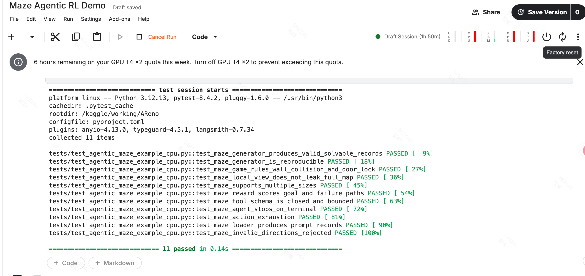
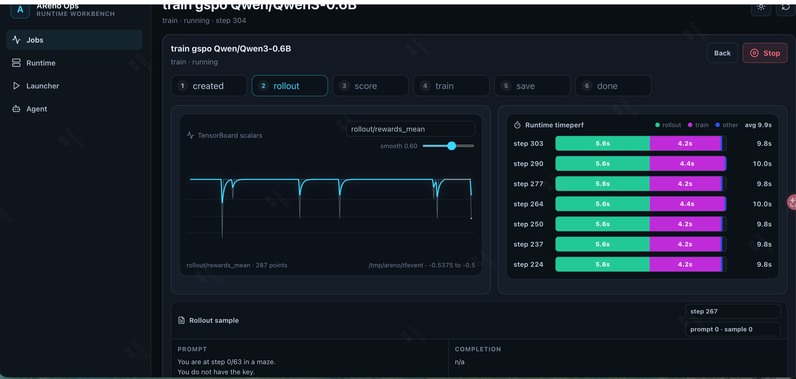

# Issue #187 迷宫 Agentic RL Demo — PR 记录

## 一、Issue 分析

Issue #187 要求构建一个部分可观测迷宫（POMDP）的 Agentic RL demo。agent 只能看到自身周围有限范围的格子，完整地图不可见；迷宫包含 walls、keys、doors、goal，需要先拾取钥匙才能通过门到达终点。

与现有 demo 的区别：tictactoe 是单步决策，shopping 是固定 4 轮，而迷宫的步数不确定（最短 8 步，最多 49 步耗尽）。这是 AReno agentic demo 矩阵中首个变长多轮 POMDP 环境。

## 二、实现记录

### 多轮结构选型

tictactoe 是单步决策（给棋盘 → 选格子 → 结束），不适用于需要连续决策的迷宫环境。shopping 的多轮 tool call 循环（调模型 → 解析 tool call → 执行 → 回填观察 → 继续）是合适的参照模式。区别在于 shopping 固定 4 轮，迷宫改为 while 循环 + terminal 判断（到达终点或步数耗尽即停）。

### 部分可观测实现

通过 `local_view(state)` 函数实现：仅渲染 agent 周围 `(2r+1)²` 个格子，视野外用 `?` 占位。以默认配置（7×7 迷宫、vision_radius=1）为例，agent 可见 9 格，全局 49 格，可见率约 18%。模型永远无法获取完整 maze 数组，只能依赖对话历史中积累的局部观察进行推断。

### BFS 搜索状态的修正

初版 `solve_shortest_path` 传入 `has_key=True`，假设 agent 从一开始就持有钥匙，BFS 可直接穿过门。但 replay 时 agent 起始无钥匙，导致所有测试数据的 reward 为 -1.0。

根因：搜索状态仅追踪位置，未追踪钥匙持有状态。修正方法是将 BFS 状态从 `Position` 扩展为 `(Position, has_key)`，搜索过程中走到钥匙格自动拾取。这样能正确计算"先取钥匙再穿门"的两段式最短路径。修正后 8 条测试数据全部跑通。

### 奖励信号的稀疏性问题

当前 `score_episode` 的奖励设计：到达终点 → `1.0 - 0.05 × excess_steps`；未到达 → 恒定 `-0.5`；无效移动 → `-0.1` per move。

未到达终点时缺乏距离梯度：距离终点 1 格和 10 格的 reward 相同。实际训练 100 步，reward_mean 稳定在 -0.5 附近，agent 未到达过终点，无正向梯度信号。后续改进方向包括引入 BFS 距离奖励或从 5×5 小迷宫开始降低难度。

### 数据集生成的容量问题

7×7 迷宫经 DFS carving + key/door 放置后，唯一变体数量有限。最初设置 `count × 50` 次尝试上限，请求 2048 个时触发 RuntimeError。

修正方案：1）随机变化 key/door 数量（1-2）和迷宫尺寸（7/9/11），扩展搜索空间；2）唯一变体耗尽后自动切换为允许重复模式，保证不报错。实测 2048 和 4096 均可生成。

## 三、Code Review

### 合理的部分

- **模式一致性**：5 个核心文件的结构与 tictactoe/shopping 对齐，函数签名（`load_training_dataset`、`reward_fn`、`run_agent`）完全一致
- **零侵入性**：未修改 `areno/` 下任何代码或 `pyproject.toml`，全部通过现有 hook 机制接入
- **环境与训练解耦**：`game.py` 零 AReno 依赖，`MazeState` 为 frozen dataclass，测试无需 mock 或 GPU
- **测试覆盖**：11 个 CPU 测试覆盖生成器、游戏规则、部分可观测、奖励、tool schema、终局、loader 契约，本地和 Kaggle 均已验证

### 不足与反思

- **状态管理黑箱**：`run_agent` 内部的 `MazeState` 对 AReno 基础设施不可见。若未来支持 rollout 重放（issue #211），此模式会形成障碍。但 shopping demo 采用相同模式，这是当前框架的既定设计
- **reward replay 开销**：`reward_fn` 完整 replay 所有 move 来计算分数，而非直接解析 `tool_results`。选择了逻辑一致性而非计算效率，避免 `run_agent` 与 `reward_fn` 维护两套状态逻辑导致不一致
- **多余 import**：测试文件最初包含未使用的 `import asyncio`，最终检查时移除
- **Kaggle 部署迭代**：文档经历多次修复（PATH 缺失、CUDA 扩展未编译、OOM、数据集生成崩溃、ngrok 启动顺序）。部分问题在本地 macOS 开发时无法预见，说明 agentic demo 的可运行性验证需覆盖目标部署环境

## 四、运行记录

### 本地 CPU 测试（macOS, Python 3.12）

```
pytest tests/test_agentic_maze_example_cpu.py -v
→ 11 passed in 0.09s
```

### 全量回归测试（macOS, Python 3.12 + CPU PyTorch）

```
pytest tests/test_agentic_maze_example_cpu.py tests/test_agentic_tictactoe_example_cpu.py \
       tests/test_agentic_shopping_example_cpu.py tests/test_agentic_cpu.py
→ 85 passed in 2.27s
```

未破坏任何现有测试。

### Kaggle CPU 测试（T4×2, Python 3.12）



```
pytest tests/test_agentic_maze_example_cpu.py -v
→ 11 passed in 0.14s
```

### Kaggle GPU 训练（T4×2, Qwen3-0.6B, GSPO）

配置：`--batch-size 2 --n-samples 4 --max-new-tokens 64 --tp-size 2 --world-size 2 --max-steps 100`

单卡（tp-size=1）触发 CUDA OOM，切换双卡张量并行（tp-size=2）后成功。每步约 9.9s（rollout 5.6s + train 4.2s），100 步约 16 分钟完成。



### 训练结果

`rollout/rewards_mean` 在 100 步内维持在 -0.5125 至 -0.5，agent 未到达过终点。原因分析：每步仅 8 个 rollout（batch-size 2 × n-samples 4），100 步共 800 次尝试，对 7×7 POMDP 环境不足；奖励稀疏导致缺乏梯度方向。后续计划：训练步数提升至 500+，引入距离奖励，或先用 5×5 迷宫降低难度。