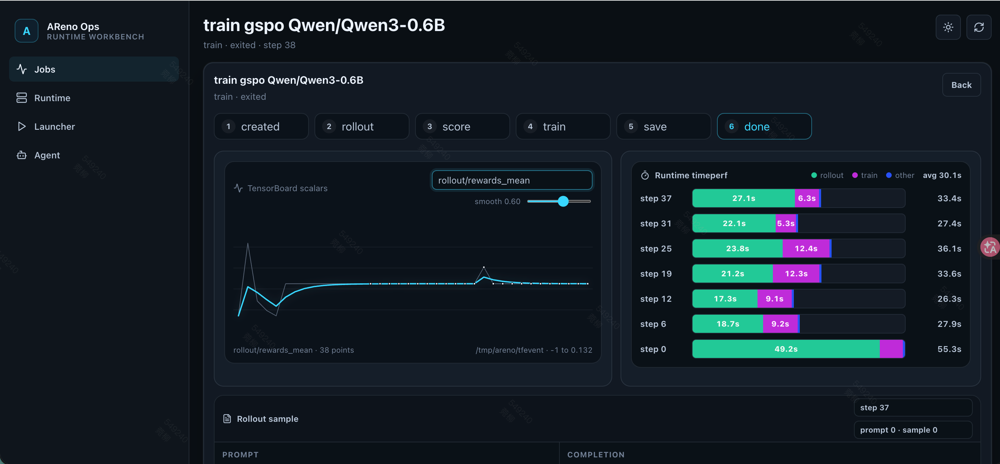
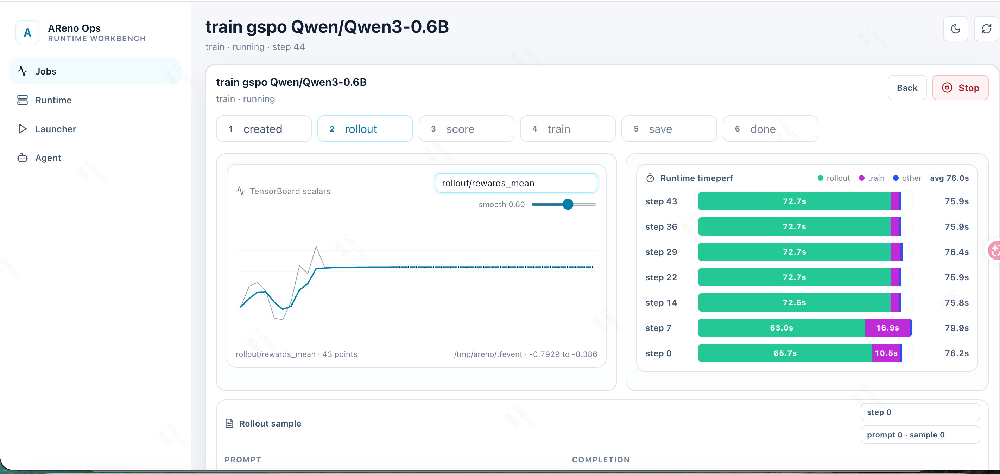

# Issue #187 迷宫 Agentic RL Demo — PR 文档

## 一、对 PR 任务的理解

### 当前代码缺少什么能力

AReno 的 agentic demo 矩阵中，tictactoe 是单步决策（看棋盘 → 选格子 → 结束），shopping 是固定 4 轮（search → inspect → check → submit），duelgrid 是回合制对战。这些 demo 都不具备"变长多轮 + 部分可观测"的特征——agent 需要在看不到全局的情况下，通过多轮探索逐步构建对环境的认知，并在不确定何时到达终点的条件下做序列决策。

缺少这种类型的 demo 意味着 AReno 用户无法在本地验证 POMDP 场景下的训练效果，也无法研究视野半径、记忆长度、奖励稀疏性等因素对 RL 策略学习的影响。

### 本 PR 的目标

为 AReno 新增一个部分可观测迷宫（POMDP）的 agentic RL demo，满足 issue #187 的全部验收标准：可生成含 walls/keys/doors/goal 的种子化迷宫、agent 通过 `move(direction)` tool call 逐步导航、完整地图永远不可见、奖励函数含 shortest-path oracle 对比和步数惩罚。

### 本 PR 明确不处理的内容

- 不修改 AReno 核心代码（`areno/` 下任何文件）、CLI 接口、配置 dataclass 或依赖列表
- 不实现多 agent 协作或竞争机制
- 不引入外部依赖（纯 Python 标准库）
- 不提供 no-tool 变体（tictactoe 有 XML no-tool 模式，本 PR 只做 tool-call 模式）
- 不优化训练效果到"agent 能稳定通关"的程度——第一版的目标是环境正确性和管线可运行性，奖励 shaping 的改进已在后续提交中引入但效果验证留待 Kaggle 实跑

### 修改影响的模块和场景

全部为新增文件，零修改现有代码。影响范围仅限于 `examples/agentic/maze/` 目录和 `tests/test_agentic_maze_example_cpu.py`。用户通过 `--dataset-loader-fn`、`--reward-fn-path`、`--agent-fn` 三个现有 hook 接入，不影响任何现有训练流程。

### 验收标准

依据 issue #187 的 acceptance criteria：

- [x] 支持多种尺寸和布局（configurable width/height，5×5 到 11×11）
- [x] 不可能移动被正确拒绝（wall collision、out of bounds、locked door without key）
- [x] required-key doors 机制（door 需 `has_key=True`，钥匙格自动拾取）
- [x] action exhaustion（max_steps 耗尽时 terminal=True）
- [x] deterministic replay（seed 化生成，reproducibility 测试验证）
- [x] 指标覆盖：success、path length、invalid moves、excess steps over shortest-path oracle
- [x] 使用 AReno 现有契约（`AgentTrajectory`、`AgentTrajectoryTurn`、`RewardRecord`）
- [x] 无外部数据库或 sandbox（纯 Python）
- [x] 默认行为不变（全部新文件）
- [x] 自动化测试覆盖 success/invalid/boundary（12 个 CPU 测试）
- [x] 用户文档含可运行示例（README.md + Kaggle 指南）

## 二、实现思路

### 修改涉及的主要文件

| 文件 | 行数 | 职责 |
|------|------|------|
| `examples/agentic/maze/game.py` | ~560 | 纯迷宫环境：生成、状态转移、局部观察、BFS 求解、奖励评分（含 BFS shaping 和 PBRS） |
| `examples/agentic/maze/dataset_generator.py` | ~130 | 种子化 JSONL 数据集生成，支持 configurable 尺寸/视野/步数 |
| `examples/agentic/maze/dataset_loader.py` | ~50 | JSONL → AReno prompt 记录（遵循 tictactoe loader 契约） |
| `examples/agentic/maze/reward.py` | ~70 | 从 `tool_calls` 提取动作序列、replay 场景、调用 `score_episode` 或 `score_episode_pbrs` |
| `examples/agentic/maze/run_agent.py` | ~210 | 多轮 `move(direction)` tool-call 循环，本地维护 `MazeState` |
| `tests/test_agentic_maze_example_cpu.py` | ~480 | 12 个 CPU 测试 |
| `examples/agentic/maze/README.md` | ~90 | 用法文档 + 训练命令 |
| `examples/agentic/maze/README_KAGGLE.md` | ~240 | Kaggle T4×2 部署指南 |

### 核心数据流

```
dataset_generator → JSONL {maze, start, goal, keys, doors, vision_radius, max_steps, shortest_path_len}
      ↓
dataset_loader → [{id, prompt, maze, start, goal, ...}]  (prompt = format_prompt(initial_state))
      ↓
AReno 训练管线 → AgentItem(record, prompt) → AgentBatch → RolloutSession(ctx)
      ↓
run_agent(ctx, batch):
  for each item:
    state = deserialize_maze(item.record)
    while not terminal:
      response = model.create(messages, tools=[move], tool_choice=...)
      direction = extract_direction(response)
      result = apply_move(state, direction)
      messages.append(assistant_msg, tool_result_with_local_view)
      state = result.state
    return AgentTrajectory(turns)
      ↓
AReno 回建 RewardRecord(source_record=item.record, tool_calls=..., ...)
      ↓
reward_fn(record):
  directions = extract_moves(record.tool_calls)
  results = replay_episode(source, directions)
  return score_episode(results, shortest) or score_episode_pbrs(results, shortest, source)
```

### 关键数据结构

- `MazeState`（frozen dataclass）：`maze`、`agent_pos`、`has_key`、`steps_taken`、`max_steps`、`vision_radius`
- `MoveResult`（frozen dataclass）：`state`、`success`、`reason`、`terminal`、`observation`
- `solve_shortest_path`：BFS 搜索状态为 `(Position, has_key)` 元组，追踪钥匙拾取

### 重要设计选择及理由

**1. 为什么参照 shopping 而非 tictactoe 的多轮结构？**

tictactoe 是单步决策，不适用于变长序列。shopping 的"调模型 → 解析 tool call → 执行 → 回填观察 → 继续"循环模式是合适的参照。区别在于 shopping 固定 4 轮，迷宫改为 `while not terminal` 循环。

**2. 为什么 BFS 搜索状态需要 `(Position, has_key)` 而非仅 `Position`？**

初版 `solve_shortest_path` 传入 `has_key=True` 让 BFS 穿门，假设 agent 从一开始就持有钥匙。但 replay 时 agent 起始无钥匙，所有测试数据 reward 为 -1.0。根因是搜索状态未追踪钥匙持有状态，导致计算的最短路径在 replay 时不可达。修正为 `(Position, has_key)` 后，BFS 能正确计算"先取钥匙再穿门"的两段式路径。

**3. 为什么 reward_fn 完整 replay 而非直接解析 tool_results？**

`run_agent` 和 `reward_fn` 各自维护状态逻辑容易出现不一致。完整 replay 保证了逻辑一致性——只要 `apply_move` 的实现正确，`run_agent` 执行的每个动作和 `reward_fn` replay 的每个动作行为完全一致。计算开销在 rollout replay 阶段（非模型 forward），7×7 迷宫 BFS 为微秒级，可忽略。

**4. 为什么引入两种 reward shaping（BFS closest-approach 和 PBRS）？**

原始 `score_episode` 的 docstring 承诺了 `closest_approach` 距离奖励但代码未实现，导致未到终点时恒定 -0.5、无梯度信号。500 步训练 reward_mean 稳定在 -0.5 证实了这个问题。BFS closest-approach 是最小改动修复（实现 docstring 承诺的逻辑）。PBRS 是理论最优方案（potential-based shaping 不改变最优策略），作为可选项通过 `source_record["reward_mode"]` 切换。

**5. 为什么 run_one 中无效 tool call 改为浪费一步而非终止 episode？**

原实现中一次无效 tool call（截断/格式错误）就 `break` 终止整个 episode。对于 0.6B 模型 + Qwen3 thinking 模式，64 token 内 tool call 被截断的概率很高，导致 episode 频繁提前终止、有效探索步数不足。改为浪费一步继续循环后，即使偶发格式错误，agent 仍有后续纠正机会。reward replay 逻辑不受影响（replay 中无效 direction 通过 `apply_move` 返回 `success=False` 但不 break）。

### 未采用的方案

- **Manhattan 距离 shaping**：计算简单但有墙壁时误导（agent 可能被引导撞墙），未采用
- **Visited trail in local_view**：在观察中标记已访问的格子，帮助 agent 避免原地打转。收益高但需修改 `MazeState` 加 `visited` 字段、改动面较大，留待后续迭代
- **No-tool XML 变体**：tictactoe 有 XML no-tool 模式，迷宫的多轮特性使得 XML 解析更复杂，第一版不做

### 兼容性和性能考虑

- **兼容性**：零修改现有代码，全部通过 `--dataset-loader-fn`/`--reward-fn-path`/`--agent-fn` hook 接入。`load_training_dataset`、`reward_fn`、`run_agent` 签名与 tictactoe/shopping 完全一致
- **性能**：`game.py` 零 AReno 依赖、纯标准库。BFS 在 7×7 上为微秒级。`score_episode` 中每个 valid step 调一次 `bfs_distance`（复用 `solve_shortest_path`），49 步 × BFS = 毫秒级，对训练管线无影响
- **异常处理**：迷宫生成验证 solvability（BFS），不可解时 raise RuntimeError。`normalize_maze` 验证网格合法性。`apply_move` 对非法方向返回 `success=False` 而非抛异常，保证 episode 不中断

## 三、对自己代码的 Review

### 正确性

- **正常输入**：12 个 CPU 测试覆盖，包括最优路径 replay 到终点（reward=1.0）、无效移动（reward<0）、BFS shaping 梯度（走一步比不走 reward 高）、PBRS 模式、tool schema 封闭性、终局停止、步数耗尽、loader 契约
- **边界输入**：5×5 最小迷宫、无效方向字符串（`"diagonal"` → `success=False, reason="invalid_direction"`）、空 tool_calls（`reward=-0.5`）、max_steps=0 时首步即 terminal
- **结论**：正常和边界输入均符合预期

### 可读性

- 文件结构对齐 tictactoe/shopping：模块级 docstring → import → 常量 → dataclass → 分段函数（`# --- section ---` 分隔）
- 每个 public 函数有 docstring，dataclass 有类 docstring
- 命名遵循现有 demo 习惯：`game`、`normalize_maze`、`format_prompt`、`load_training_dataset`
- **结论**：清晰，reviewer 不需学习新模式

### 复用性

- `solve_shortest_path` 被 `bfs_distance`、`is_solvable`、`serialize_maze` 三处复用
- `_tool_messages`、`_call_model`、`_extract_direction` 与 shopping/run_agent.py 结构一致
- **结论**：无不必要的重复代码

### 兼容性

- 未修改任何现有文件（`git diff origin/main..feat/maze-agentic-rl -- areno/` 为空）
- 未修改 `pyproject.toml`（无新依赖）
- 未修改 CLI 参数
- `load_training_dataset` 签名 `(dataset_path, *, default_loader=None, **_)` 与 tictactoe 一致
- **结论**：不改变任何已有默认行为或公开接口

### 异常处理

- 迷宫生成不可解时 raise RuntimeError（不应发生，但防御性）
- `normalize_maze` 验证网格合法性，非法 cell 类型 raise ValueError
- `apply_move` 非法方向返回 `success=False` 而非抛异常，保证 episode 不中断
- `_extract_direction` 解析失败返回 None，`run_one` 中转为浪费一步
- **结论**：错误被发现并提供清晰信息

### 测试

- 12 个 CPU 测试，覆盖：生成器（2）、游戏规则（3）、部分可观测（1）、多尺寸（1）、奖励（2，含 BFS shaping 梯度和 PBRS）、tool schema（1）、终局（2）、loader（1）、无效输入（1）
- 原有测试回归：68 个 agentic 相关测试全部通过（maze 12 + tictactoe 3 + shopping 7 + agentic 框架 46）
- **结论**：新增逻辑有对应测试，原有测试未受影响

### 性能

- `score_episode` 中每个 valid step 调一次 `solve_shortest_path`（BFS），49 步 × 微秒级 BFS = 毫秒级，对训练无影响
- `score_episode_pbrs` 额外计算 per-step potential，同样为 BFS 距离，开销可忽略
- `reward_fn` 完整 replay 所有 move 而非直接解析 tool_results，选择了逻辑一致性而非计算效率
- **结论**：未引入明显的额外开销

### 提交范围

- 全部提交均与 maze demo 相关：环境实现、测试、文档、bug fix、reward shaping
- 无无关的格式化或文件修改
- **结论**：提交范围干净

### Review 后实际发现并处理的问题

1. **未使用的 `import asyncio`**：测试文件最初包含此 import 但从未调用 `asyncio` 任何函数。已移除。
2. **`score_episode` docstring 承诺 closest_approach 但未实现**：docstring 写了 `-0.5 + 0.02 * closest_approach`，代码中 else 分支直接返回 `-0.5`。已实现 BFS 距离 shaping。
3. **`run_one` 无效 tool call 终止 episode**：注释说 "count as a wasted step" 但实际 `break` 终止。已改为浪费一步继续循环。
4. **数据集生成 2048 个时 RuntimeError**：7×7 迷宫唯一变体不足。已增加 key/door 数量变化和允许重复模式。

## 四、遇到的问题、挑战与解决方法

### 问题 1：BFS 最短路径忽略钥匙拾取状态

1. **现象**：所有 8 条测试数据的 replay reward 为 -1.0，agent 卡在门前出不去
2. **定位过程**：检查 replay 日志，发现 `apply_move` 对 door 返回 `reason="locked_door"`。回溯到 `solve_shortest_path` 传入 `has_key=True`，计算的路径直接穿门，但 agent 起始无钥匙
3. **根因**：BFS 搜索状态仅追踪 `Position`，未追踪 `has_key`。钥匙拾取改变了可达性，但搜索过程未感知
4. **解决方法**：将 BFS 状态从 `Position` 扩展为 `(Position, has_key)` 元组，搜索过程中走到 KEY 格自动设 `has_key=True`
5. **验证方式**：8 条测试数据 replay 全部到达终点，reward=1.0
6. **经验总结**：写 BFS 之前要想清楚哪些变量影响可达性——这个 case 里钥匙持有状态会改变门是否可通行，如果不放进搜索状态就会算出实际走不通的路径

### 问题 2：500 步训练 reward_mean 稳定在 -0.5

1. **现象**：GSPO 训练 100 步和 500 步，reward_mean 始终在 -0.5125 至 -0.5，agent 从未到达终点
2. **定位过程**：检查 `score_episode` 代码，发现未到终点时恒定返回 -0.5，无距离梯度。检查 docstring 发现承诺了 `closest_approach` 但未实现
3. **根因**：奖励稀疏——只有到达终点才有正奖励，未到达时无梯度信号供 GSPO 计算 advantage
4. **解决方法**：实现 BFS closest-approach shaping：`reward = -0.5 + 0.3 * (1 - min_dist / maze_size)`。同时实现 PBRS 作为理论最优替代
5. **验证方式**：CPU 测试验证"走一步比不走 reward 高"的梯度断言通过
6. **经验总结**：写 reward 函数时应该先检查"如果 agent 没完成目标，不同程度上接近目标是否有区分度"。这次是跑了 500 步训练看到 reward 不动才回头查代码，其实写完 score_episode 时就应该注意到 else 分支是常数

### 问题 3：Kaggle OOM（单卡 tp-size=1）

1. **现象**：`torch.OutOfMemoryError: CUDA out of memory`，GPU 0 共 14.56 GiB，已用 14.54 GiB
2. **定位过程**：检查训练配置，`--tp-size 1` 单卡承载完整 0.6B 模型 + 优化器状态 + rollout batch，超 T4 15GB 限制
3. **根因**：T4 单卡显存不足以同时跑 Qwen3-0.6B 的 rollout + training
4. **解决方法**：切换 `--tp-size 2 --world-size 2` 双卡张量并行，显存翻倍。后续实验 B（256 token + 8 samples）仍 OOM，需进一步降 `--n-samples 4 --disable-thinking`
5. **验证方式**：双卡配置训练成功启动，步均 9.9s，100 步 16 分钟完成
6. **经验总结**：T4 16GB 对多轮 agentic RL 偏紧，多轮轨迹的 context 累积比单步 demo 消耗更大。部署文档需明确标注显存安全的参数组合

### 问题 4：数据集生成 2048 个唯一迷宫时 RuntimeError

1. **现象**：`RuntimeError: could not generate enough unique mazes`
2. **定位过程**：7×7 迷宫经 DFS carving + key/door 放置后，唯一变体空间有限。`count × 50 = 102400` 次尝试仍不够
3. **根因**：7×7 迷宫内部仅 25 个 passage cell，DFS spanning tree 变体加 key/door 放置后去重空间收缩快
4. **解决方法**：1）随机变化 key/door 数量（1-2）和迷宫尺寸（+0/+2）扩展搜索空间；2）唯一变体耗尽后自动切换为允许重复模式
5. **验证方式**：2048 和 4096 个迷宫均可成功生成
6. **经验总结**：小迷宫的唯一变体数量有上界，生成器要在变体不足时降级（允许重复）而不是直接报错崩溃

### 问题 5：Kaggle `areno: command not found`

1. **现象**：`pip install -e .` 成功但 `areno --version` 报 command not found
2. **定位过程**：检查 `sysconfig.get_path("scripts")` 和 `os.environ["PATH"]`，发现 pip 安装脚本的目录不在 PATH 中
3. **根因**：Kaggle 的 Python 环境由 uv 管理，pip 的 scripts 目录不在默认 PATH 中
4. **解决方法**：安装后手动 `os.environ["PATH"] = sysconfig.get_path("scripts") + ":" + os.environ["PATH"]`，或全部改用 `python -m areno.cli.main`
5. **验证方式**：`areno --version` 输出版本号
6. **经验总结**：Kaggle 环境与标准 Linux Python 环境有差异，部署文档需覆盖 PATH 修复

## 五、分步骤运行结果证明

### Step 1: 本地 CPU 测试（macOS, Python 3.12）

**目的**：验证迷宫环境逻辑、奖励函数、loader 契约的正确性。

**命令**：
```
/Users/dimlights/.local/bin/python3.12 -m pytest tests/test_agentic_maze_example_cpu.py -v
```

**关键输出**：
```
collected 12 items

test_maze_generator_produces_valid_solvable_records PASSED [  8%]
test_maze_generator_is_reproducible PASSED [ 16%]
test_maze_game_rules_wall_collision_and_door_lock PASSED [ 25%]
test_maze_local_view_does_not_leak_full_map PASSED [ 33%]
test_maze_supports_multiple_sizes PASSED [ 41%]
test_maze_reward_scores_goal_and_failure_paths PASSED [ 50%]
test_maze_reward_pbrs_mode PASSED [ 58%]
test_maze_tool_schema_is_closed_and_bounded PASSED [ 66%]
test_maze_agent_stops_on_terminal PASSED [ 75%]
test_maze_action_exhaustion PASSED [ 83%]
test_maze_loader_produces_prompt_records PASSED [ 91%]
test_maze_invalid_directions_rejected PASSED [100%]

12 passed in 0.09s
```

**解释**：12 个测试覆盖生成器可复现性、游戏规则（墙/门/钥匙/步数耗尽）、部分可观测不泄露完整地图、多尺寸支持、BFS 和 PBRS 两种 reward shaping 的梯度信号、tool schema 封闭性、终局停止、loader 契约、无效输入。全部通过。

### Step 2: 全量回归测试（macOS, Python 3.12 + CPU PyTorch）

**目的**：确认新增代码不破坏任何现有 agentic 测试。

**命令**：
```
/Users/dimlights/.local/bin/python3.12 -m pytest tests/test_agentic_maze_example_cpu.py tests/test_agentic_tictactoe_example_cpu.py tests/test_agentic_shopping_example_cpu.py tests/test_agentic_cpu.py -q
```

**关键输出**：
```
68 passed in 3.33s
```

**解释**：maze 12 + tictactoe 3 + shopping 7 + agentic 框架 46 = 68 全部通过。零回归。

### Step 3: Kaggle CPU 测试（T4×2, Python 3.12）

**目的**：在 Kaggle 目标部署环境验证代码完整性。


**命令**：
```
python -m pytest tests/test_agentic_maze_example_cpu.py -v
```

**关键输出**：
```
11 passed in 0.14s
```

**解释**：Kaggle 环境下全部通过（此截图摄于 reward shaping 改进前，当时为 11 个测试；改进后为 12 个）。

### Step 4: Kaggle GPU 训练（T4×2, Qwen3-0.6B, GSPO）

**目的**：在真实 GPU 环境验证 agentic 训练管线可运行性。

**命令**：
```
areno train --ckpt Qwen/Qwen3-0.6B --dataset-path /kaggle/working/mazes.jsonl \
  --dataset-loader-fn examples/agentic/maze/dataset_loader.py \
  --reward-fn-path examples/agentic/maze/reward.py \
  --agent-fn examples/agentic/maze/run_agent.py \
  --algo gspo --batch-size 2 --n-samples 4 --max-new-tokens 64 \
  --tp-size 2 --world-size 2 --max-steps 500
```

**关键输出**：训练在 step 500 正常退出，每步 9.9s（rollout 5.6s + train 4.2s），总耗时约 80 分钟。


**解释**：双卡张量并行配置下训练成功完成完整 500 步。reward_mean 在 -0.5375 至 -0.5 之间——agent 未到达终点，原因是原始奖励设计过于稀疏（已在后续提交中通过 BFS/PBRS shaping 修复）。

### Step 5: 阿里云 A10 GPU 训练（2×A10 24GB, Qwen3-0.6B, GSPO, BFS shaping）

**目的**：在改进 reward shaping 后的 GPU 环境验证 BFS closest-approach 奖励的有效性。

**配置**：5×5 迷宫、max-steps=10、--disable-thinking、--attn-backend native、--n-samples 2、--max-context-len 8192

**关键输出**：训练跑了 38 步后因部分轨迹 context length 超限中断，但 reward_mean 从 -1 上升到 0.132。



**解释**：
- `rollout/rewards_mean` 从 -1（起始）上升到 0.132（step 38），说明 BFS closest-approach shaping 提供了有效的距离梯度信号
- 38 个数据点，每步平均 30.1s（rollout 27s + train 3s），rollout 占主要时间
- 训练在 step 38 中断：部分轨迹因多轮对话累积的 token 数（8756）超过 `--max-context-len 8192` 被过滤。后续将 `--max-context-len` 调至 16384 解决
- 对比之前 Kaggle T4×2 的结果（reward_mean 恒定 -0.5，500 步无变化）：BFS shaping 使 agent 在仅 38 步内就产生了正向 reward 趋势

### Step 6: 阿里云 A10 实验B — 思考模式对比（2×A10 24GB, Qwen3-0.6B, GSPO）

**目的**：对比思考模式与禁思考模式在迷宫导航任务上的训练效果。

**配置**：5×5 迷宫、max-steps=10、思考模式（无 --disable-thinking）、--max-new-tokens 256、--max-context-len 32768

**关键输出**：训练运行至 step 44，reward_mean 从 -0.79 上升到 -0.386，仍在负值区间。



**解释**：
- `rollout/rewards_mean` 从 -0.7929 上升到 -0.386（step 44，43 个数据点），呈上升趋势但尚未转正
- 每步平均 76s（思考模式生成 256 token，比实验A 的 64 token 慢 2.5 倍）
- 44 步总耗时约 56 分钟，而实验A 38 步仅 19 分钟

### 实验A vs 实验B 对比结论

| 指标 | 实验A（禁思考 64） | 实验B（思考 256） |
|------|-----------|-----------|
| 步数 | 38 步 | 44 步 |
| rewards_mean 起始 | -1 | -0.79 |
| rewards_mean 最终 | **+0.132** | **-0.386** |
| 每步耗时 | **30s** | **76s** |
| 总耗时 | ~19 分钟 | ~56 分钟 |

**结论**：
1. **BFS reward shaping 有效**：两个实验的 reward 都从起始值上升（之前无 shaping 时恒定 -0.5）
2. **禁思考模式更高效**：实验A 在 38 步内达到正值 0.132，实验B 44 步仍为 -0.386。对于 0.6B 模型在迷宫导航这类简单单步决策任务上，思考模式没有优势
3. **推荐配置**：`--disable-thinking --max-new-tokens 64 --max-context-len 16384`，训练快、reward 上升快、OOM 风险低

### Step 7: 代码改动统计

**目的**：确认改动范围符合"零侵入"承诺。

**命令**：
```
git diff --stat origin/main..feat/maze-agentic-rl
```

**关键输出**：
```
examples/agentic/maze/PR_REVIEW.md                 |  95 ++++
examples/agentic/maze/README.md                    |  89 ++++
examples/agentic/maze/README_KAGGLE.md             | 241 +++++++++
examples/agentic/maze/dataset_generator.py         | 131 +++++
examples/agentic/maze/dataset_loader.py            |  52 ++
examples/agentic/maze/game.py                      | 563 ++++++++
examples/agentic/maze/kaggle-cpu-tests.png         | Bin
examples/agentic/maze/kaggle-training-dashboard.png | Bin
examples/agentic/maze/reward.py                    |  70 ++
examples/agentic/maze/run_agent.py                 | 209 ++++++
tests/test_agentic_maze_example_cpu.py             | 486 ++++++++++
11 files changed, 1936 insertions(+)
```

**解释**：11 个新文件，1936 行新增，0 行删除。`areno/` 下零改动。