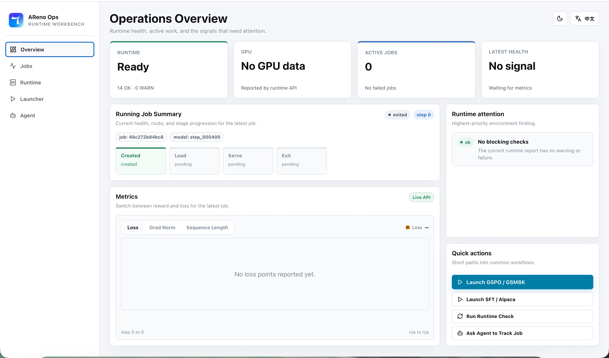
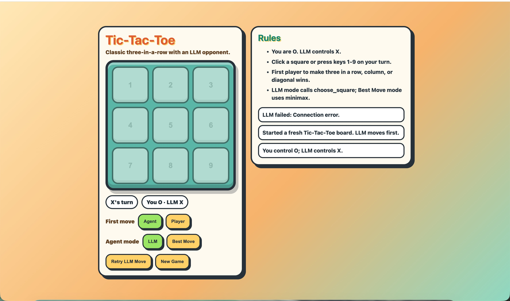

# 在 DGX Spark 上使用 AReno 训练 Ling 3.0 Tiny 玩井字棋

[English](DGX_SPARK_GUIDE_EN.md) | **中文**

本文介绍如何在 NVIDIA DGX Spark 上使用 AReno 和 `inclusionAI/Ling-3.0-tiny`，通过 GSPO 强化学习训练一个能够调用工具完成井字棋决策的模型。

## 环境准备

建议使用 Docker 环境运行 AReno：

```bash
git clone https://github.com/inclusionAI/AReno
cd AReno
docker build -t areno:latest .
```

## 启动 Docker 容器

```bash
docker run -d \
  --name areno \
  --gpus all \
  --network host \
  --ipc=host \
  --ulimit memlock=-1 \
  --ulimit stack=67108864 \
  areno:latest \
  sleep infinity
```

进入容器，并切换到 AReno 项目目录：

```bash
docker exec -it areno bash
cd /workspace/AReno
```

具体项目路径取决于构建镜像时 Dockerfile 设置的工作目录。

## 生成井字棋数据集

```bash
python examples/agentic/tictactoe/dataset_generator.py \
  --count 2048 \
  --output ./tictactoe_boards.jsonl
```

数据集生成逻辑如下：

1. 创建空的 3x3 棋盘，空格用 `"."` 表示。
2. 从 X 开始，随机走 0 到 6 步。
3. 每一步只能从当前合法空位中随机选择。
4. 一旦出现胜负或棋盘结束，就停止继续落子。
5. 最终只保留轮到 X 行动、尚未结束且不重复的局面。
6. 使用固定随机种子，因此相同参数可以重复生成相同数据。
7. 如果随机过程结束时轮到 O，生成器会额外随机落一个 O，使最终轮到 X。

一条数据示例如下：

```json
{"id":"generated-00000","board":[["X",".","O"],[".",".","."],["X","O","."]]}
```

原始 JSONL 只保存局面。`dataset_loader.py` 会在训练时将棋盘转换为 prompt，并动态计算合法动作和 minimax 最优动作。

## Reward 设计

为了让训练信号尽量直接，井字棋任务采用以下 reward：

- 没有合法的 `choose_square` tool call：`-1.0`
- 参数无法解析或选择已占用格子：`-1.0`
- 当前一步让 X 立即获胜：`1.0`
- 没有立即获胜，但属于 minimax 最优动作：`0.8`
- 合法但非最优动作：`0.0`

这个 reward 主要训练三种能力：

- 使用正确的工具调用格式行动。
- 遵守棋盘状态，不选择已占用格子。
- 在合法行动的基础上选择更优策略。

这也是 AReno 希望展示的后训练流程：开发者可以从一个边界明确的任务开始，定义环境和 reward，跑通 rollout 与训练，再观察模型行为的变化。

## 运行训练任务

先设置 checkpoint 输出目录：

```bash
export SAVE_PATH=/workspace/checkpoints/tictactoe
mkdir -p "$SAVE_PATH"
```

启动训练：

```bash
areno train \
  --algo gspo \
  --mini-bs 1 \
  --ckpt inclusionAI/Ling-3.0-tiny \
  --dataset-path tictactoe_boards.jsonl \
  --dataset-loader-fn examples/agentic/tictactoe/dataset_loader.py \
  --reward-fn-path examples/agentic/tictactoe/reward.py \
  --agent-fn examples/agentic/tictactoe/run_agent.py \
  --save-interval 100 \
  --save-path "$SAVE_PATH" \
  --world-size 1 \
  --tp-size 1 \
  --drop-rollout-state \
  --batch-size 4 \
  --n-samples 4 \
  --max-running-prompts 16 \
  --max-prompt-tokens 1024 \
  --max-new-tokens 1471 \
  --adam-8bit \
  --lr 0.00000001 \
  --min-lr 0.000000001
```

这条命令使用 GSPO 在单卡上训练 Ling 3.0 Tiny，让模型根据井字棋局面调用 `choose_square` 工具选择下一步。

### 重要参数

- `--algo gspo`：使用 GSPO，根据 rollout reward 更新策略。
- `--ckpt inclusionAI/Ling-3.0-tiny`：指定初始模型 checkpoint。
- `--dataset-path`：指定棋盘初始状态 JSONL。
- `--dataset-loader-fn`：将棋盘转换成 prompt，并计算合法动作和 minimax 最优动作。
- `--agent-fn`：为每个样本请求模型调用一次 `choose_square` 工具。
- `--reward-fn-path`：从工具调用中提取所选格子并评分。
- `--batch-size 4`：每个训练 step 读取 4 个不同棋盘。
- `--n-samples 4`：每个棋盘采样 4 个回答，每步共生成 `4 x 4 = 16` 条 rollout。
- `--max-running-prompts 16`：最多并发处理 16 个生成请求，刚好覆盖本步全部 rollout。
- `--mini-bs 1`：每个训练 micro batch 处理一条 rollout，显存占用较低，但训练调用次数更多。
- `--max-prompt-tokens 1024`：prompt 的最大 token 数。井字棋 prompt 通常远低于该限制。
- `--max-new-tokens 1471`：单次生成的最大 token 数。该任务通常只需要一次工具调用，可以根据模型行为降至 `64` 到 `256` 以减少成本。
- `--world-size 1 --tp-size 1`：使用一张 GPU，不启用 tensor parallel。
- `--drop-rollout-state`：每个 step 后释放 rollout 状态，降低跨 step 显存占用，但增加下一步重建开销。
- `--adam-8bit`：使用 8-bit Adam 状态，降低优化器显存占用。
- `--lr 0.00000001`：峰值学习率为 `1e-8`。
- `--min-lr 0.000000001`：最低学习率为 `1e-9`。
- `--save-interval 100`：每 100 个训练 step 保存一次 checkpoint。
- `--save-path "$SAVE_PATH"`：指定 checkpoint 输出目录。

总体上，每一步使用 4 个棋盘产生 16 条候选轨迹，根据工具调用选择的格子计算 reward，再以 `mini_bs=1` 完成 GSPO 更新。

## 使用 Dashboard 查看任务状态

```bash
areno dashboard --start --host 0.0.0.0 --port 8000
```

在浏览器访问 DGX Spark 的 `8000` 端口：



## 评测

启动训练后 checkpoint 的推理服务：

```bash
areno serve \
  --model-path /new_tiny/step_000400/ \
  --max-running-prompts 1 \
  --default-max-tokens 4096 \
  --port 8001
```

请根据实际保存目录替换 `/new_tiny/step_000400/`。

启动井字棋 Web UI：

```bash
python examples/agentic/tictactoe/web_ui.py \
  --host 0.0.0.0 \
  --port 8002 \
  --agent-mode llm \
  --base-url http://localhost:8001/v1 \
  --api-key xx \
  --model ling
```

在浏览器访问 DGX Spark 的 `8002` 端口，即可与模型进行井字棋对局：


